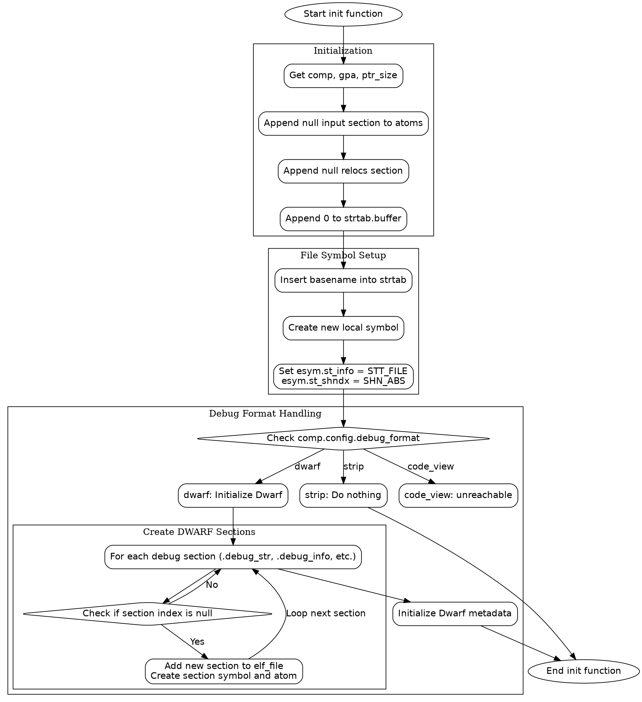

嗯，我现在需要帮用户分析一个用 Zig 写的函数，并生成对应的流程图。首先，我得仔细阅读这段代码，理解它的结构和逻辑。函数名是`init`，属于`ZigObject`结构体。它接受三个参数：`self`指针、`elf_file`指针和`options`。返回类型是错误联合的`void`。

首先，函数开始处有一些初始化操作，比如获取`comp`、`gpa`和`ptr_size`。然后向`atoms`、`relocs`和`strtab.buffer`添加初始元素。这部分应该是初始化一些基础数据结构。

接下来，有一个块，处理文件名相关的符号。这里创建了一个本地符号，设置其类型为`STT_FILE`，节索引为`SHN_ABS`。这部分可能是为了在ELF文件中标记源文件信息。

然后，根据`comp.config.debug_format`的值，分为不同的情况。`.strip`表示不需要调试信息，直接跳过。`.dwarf`则需要处理DWARF调试信息，这里有很多条件判断，检查各个调试节是否存在，不存在则创建对应的节，并添加符号和原子（atom）。比如`.debug_str`、`.debug_info`等节的处理，每个节都调用`addSectionSymbolWithAtom`函数，并设置相关属性。

在处理`.eh_frame`节时，根据目标架构是否为x86_64来选择节类型，并设置对齐方式。最后初始化`dwarf`元数据，并将其赋值给`self.dwarf`。

`.code_view`的情况则是`unreachable`，说明当前不支持这种调试格式。

接下来，我需要将这些逻辑步骤转化为流程图。流程图应该包括开始和结束节点，各个主要操作步骤，以及条件分支。例如，初始化部分、处理符号、根据debug_format分支，各个DWARF节的创建等。

需要注意的是，函数中有多个条件判断，比如各个`if (self.debug_str_index == null)`等，这些都需要在流程图中体现为判断节点，不同的分支对应不同的处理步骤。此外，循环结构可能出现在`try`语句中，但根据代码来看，这里主要是顺序执行和条件判断，没有明显的循环结构。

在绘制流程图时，使用graphviz的语法，用节点表示操作步骤，箭头表示流程方向，菱形表示条件判断。例如，开始节点指向初始化步骤，然后是处理符号，接着进入debug_format的判断，如果是dwarf，则依次处理各个调试节，每个节的创建都是一个步骤，带有条件判断是否已经存在。

需要确保每个条件分支都正确连接，比如每个`if`语句都有true和false的分支。但由于代码中的每个`if`都是检查某个节是否已创建，如果未创建则执行创建步骤，所以可能每个条件都是单分支，即如果条件成立（索引为null），则执行创建，否则跳过。这种情况下，可能不需要显式的false分支，直接继续下一个步骤。

最后，流程图的结束节点应位于函数末尾，即完成所有初始化后的返回。
================================================
