嗯，我需要为这个名为dumpArgv的Zig函数画一个流程图。首先，我得仔细看看这个函数的结构和逻辑。函数的主要目的是构建一个命令行参数列表argv，然后调用Compilation.dump_argv来输出这些参数。看起来这个函数处理了不同的链接情况，比如静态库、动态库、可重定位对象等，并根据不同的条件添加不同的参数。

首先，函数开始初始化一些分配器，获取输出路径和模块对象路径。然后根据是否是静态库选择使用ar还是ld。接着处理不同的链接输入，比如对象文件、归档文件、动态共享对象等。如果是可重定位的，会添加所有链接输入和C对象文件；否则，处理动态链接相关的参数，比如-platform_version、sysroot、rpath等。

接下来，函数处理各种选项，如页大小、头填充、GC段、入口点等。然后添加输出路径，处理动态库的未定义符号查找。之后，再次处理链接输入，排除DSO，添加强制加载的对象。然后添加C对象和模块对象路径。处理线程消毒剂和模糊测试相关的库。添加库目录、框架目录和框架。最后链接libSystem、编译器运行时库等。

我需要将所有这些逻辑步骤转化为流程图中的各个节点。需要注意的是条件分支，比如if语句，每个条件对应不同的路径。例如，函数中有多个if (self.base.isStaticLib())、if (self.base.isObject())等条件判断，这些都需要在流程图中体现为决策节点。

可能需要将整个流程分成几个主要部分：初始化、处理可重定位对象、处理非可重定位对象（动态链接）、处理链接输入、添加额外参数等。每个部分内部的条件分支也要详细画出。由于函数较长且条件较多，流程图可能会比较复杂，需要确保每个判断和对应的操作都清晰展示。

另外，要注意函数中的循环结构，例如for循环遍历comp.link_inputs、self.lib_directories等，这些在流程图中应表示为循环节点，标明循环的开始和结束。

最后，确保流程图的开始和结束节点正确，从函数入口开始，到调用dump_argv结束。可能还需要处理错误情况，但根据代码中的try语句，错误会向上抛出，可能在流程图中以错误处理节点表示，但原函数中并未显式处理错误，所以可能不需要特别标注。
================================================

```dot
digraph flowchart {
    node [shape=rectangle, style="rounded", fontname="Arial"];
    edge [fontname="Arial"];
    
    start [label="开始"];
    init_alloc [label="初始化分配器\n(arena_allocator)"];
    get_paths [label="获取输出路径\n(full_out_path)\n和模块对象路径\n(module_obj_path)"];
    create_argv [label="创建argv列表\n并添加'zig'命令"];
    check_static_lib [label="检查是否是静态库？"];
    add_ar [label="添加'ar'到argv"];
    add_ld [label="添加'ld'到argv"];
    check_object [label="检查是否是对象文件？"];
    add_r_flag [label="添加'-r'到argv"];
    check_relocatable [label="检查是否可重定位？"];
    handle_reloc_inputs [label="遍历comp.link_inputs\n添加对象/归档/资源路径"];
    add_c_objects [label="添加C对象文件路径"];
    add_module_obj [label="添加模块对象路径\n(如果存在)"];
    handle_non_reloc [label="处理非可重定位链接"];
    add_dynamic [label="添加'-dynamic'"];
    check_dynlib [label="检查是否是动态库？"];
    add_dylib [label="添加'-dylib'\n处理install_name"];
    platform_version [label="添加-platform_version\n和系统版本号"];
    handle_sysroot [label="添加-syslibroot"];
    handle_rpath [label="遍历rpath列表\n添加'-rpath'"];
    handle_pagezero [label="处理pagezero_size"];
    handle_headerpad [label="处理headerpad参数"];
    handle_gc_sections [label="添加-dead_strip"];
    handle_entry [label="处理-entry参数"];
    add_output [label="添加'-o'和输出路径"];
    handle_undefined [label="处理动态库未定义符号"];
    process_link_inputs [label="再次处理link_inputs\n排除DSO，添加-force_load"];
    add_compiler_rt [label="添加编译器运行时库"];
    lib_dirs [label="遍历lib_directories\n添加'-L'参数"];
    handle_dso [label="处理DSO链接参数\n(-needed-l/-weak-l)"];
    framework_handling [label="处理框架目录和框架参数"];
    add_system_lib [label="添加-lSystem"];
    dump_argv [label="调用dump_argv输出参数"];
    end [label="结束"];

    start -> init_alloc -> get_paths -> create_argv;
    create_argv -> check_static_lib;
    check_static_lib -> add_ar [label="是"];
    check_static_lib -> add_ld [label="否"];
    add_ar -> check_object;
    add_ld -> check_object;
    check_object -> add_r_flag [label="是"];
    check_object -> check_relocatable [label="否"];
    add_r_flag -> check_relocatable;
    check_relocatable -> handle_reloc_inputs [label="是"];
    check_relocatable -> handle_non_reloc [label="否"];
    handle_reloc_inputs -> add_c_objects -> add_module_obj -> dump_argv;
    
    handle_non_reloc -> add_dynamic [label="非静态"];
    add_dynamic -> check_dynlib;
    check_dynlib -> add_dylib [label="是"];
    check_dynlib -> platform_version [label="否"];
    add_dylib -> platform_version;
    platform_version -> handle_sysroot -> handle_rpath -> handle_pagezero;
    handle_pagezero -> handle_headerpad -> handle_gc_sections -> handle_entry;
    handle_entry -> add_output -> handle_undefined -> process_link_inputs;
    process_link_inputs -> add_compiler_rt -> lib_dirs -> handle_dso;
    handle_dso -> framework_handling -> add_system_lib -> dump_argv;
    
    dump_argv -> end;
}
```
