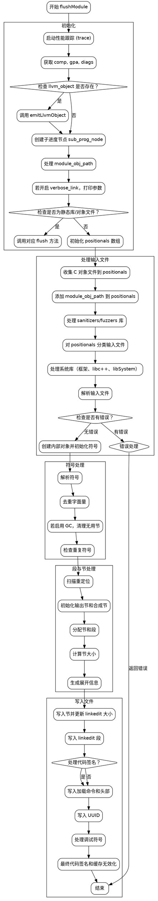

嗯，我现在要画这个函数的流程图。首先，我得仔细看看这个函数的结构。这个函数叫flushModule，属于MachO结构体的方法。看起来它处理的是链接过程中的各种步骤，比如处理输入文件、符号解析、段和节的分配、写输出文件等等。

首先，函数开始的时候，调用了trace(@src())，然后defer tracy.end()，这应该是性能分析的跟踪。接下来，获取comp、gpa、diags这些变量。然后检查是否有llvm_object，如果有的话，调用emitLlvmObject。这部分可能涉及到生成LLVM对象文件。

接下来，创建了一个子进度节点sub_prog_node，用于跟踪进度。然后处理module_obj_path，根据一些条件构建路径。如果开启了verbose_link，就调用dumpArgv打印参数。

然后，根据不同的情况处理静态库、对象文件等，调用不同的flush方法。之后，初始化positionals数组，处理各种链接输入，比如对象文件、归档文件等。这里还处理了C对象文件，以及一些特定的库，比如tsan、fuzzer等。

接着处理系统库，包括框架、libc++、libSystem等。然后对输入文件进行分类，解析依赖的动态库。如果发现错误，返回错误。之后创建内部对象，初始化符号，解析符号，处理未定义的符号，重复字面量，进行垃圾回收，检查重复符号，标记导入导出，处理动态库的顺序。

然后进行重定位扫描，初始化输出节和合成节，分配段和节，计算节的大小，生成展开信息。接着调整节的大小，解决重定位，写入节到文件，分配链接编辑段，处理代码签名。

最后，写入加载命令、头部、UUID，处理调试符号，代码签名，以及无效化内核缓存。整个过程涉及到很多错误处理，很多步骤都可能抛出错误，需要捕获并处理。

接下来，我需要将这些步骤转化为流程图。流程图应该从函数入口开始，按照顺序处理各个步骤，每个条件判断和循环需要分支。比如，处理llvm_object是否存在，是否是静态库或对象文件，各种错误处理路径等。需要注意的是，这个函数中有很多可能的错误路径，但流程图可能不需要画出每一个错误处理，而是主要展示正常流程和主要分支。

可能需要将流程分为几个主要阶段：初始化阶段、处理输入文件、符号解析与处理、段和节的分配与写入、代码签名与最终输出。每个阶段内的步骤按顺序排列，条件判断用菱形框表示，循环结构用循环框。由于代码中有很多错误处理，但可能不需要在流程图中详细画出每个错误返回点，而是用通用的错误处理节点表示。

另外，需要注意函数的返回点，比如在错误发生时返回error.LinkFailure或其他错误。流程图的结束点可能有多个，但可以合并为成功结束和错误结束两种情况。

现在，我需要将这些思考整理成一个结构化的流程图，使用Graphviz的DOT语言来表示。确保节点之间的连接正确，步骤顺序准确，分支条件清晰。
================================================
