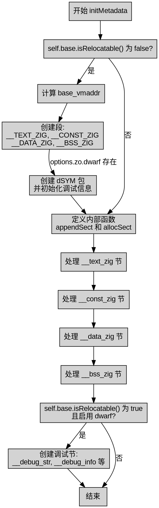

好的，我现在需要为给定的Zig函数生成一个Graphviz的流程图。首先，我需要理解这个函数的结构和逻辑。

首先，函数名为initMetadata，属于MachO结构体的方法。它接收一个指向MachO的指针和InitMetadataOptions作为参数，并返回一个错误联合类型。函数的主要任务是初始化MachO文件的元数据，包括段（segments）和节（sections）的创建，以及可能的调试信息的处理。

函数开始检查self.base.isRelocatable()是否为false，如果不是可重定位的（即不是目标文件），则执行以下步骤：

1. 计算base_vmaddr，基于pagezero_size，默认对齐到页面大小。
2. 创建四个段：__TEXT_ZIG、__CONST_ZIG、__DATA_ZIG和__BSS_ZIG，每个段有不同的属性和虚拟内存地址。
3. 如果options中包含dwarf调试信息，创建dSYM包，并初始化调试信息。

接下来，定义了两个内部函数appendSect和allocSect，分别用于将节附加到段或分配节的空间。然后，根据是否为可重定位文件，分别处理各个节（__text_zig、__const_zig、__data_zig、__bss_zig），将它们添加到对应的段中，或者分配空间。

最后，如果是可重定位文件且启用了dwarf调试信息，创建多个调试节，并初始化dwarf元数据。

现在需要将这些逻辑步骤转化为流程图。流程图通常包括开始、结束、条件判断、处理步骤等节点，并用箭头连接它们。

可能的流程节点：

- 开始
- 检查是否非可重定位（if (!self.base.isRelocatable())）
  - 是：处理段和可能的dSYM
  - 否：跳过段处理
- 定义appendSect和allocSect函数
- 处理各个节（text, const, data, bss），根据是否可重定位选择alloc或append
- 处理调试节（如果可重定位且dwarf启用）
- 结束

需要注意的是，函数内部的闭包（如appendSect和allocSect）可能不需要单独节点，但它们的调用处需要体现。

另外，条件判断需要分支，比如处理每个节时的条件判断。

可能的Graphviz结构：

digraph {
    start [label="开始initMetadata"]
    check_reloc [label="检查是否非可重定位"]
    handle_segments [label="处理段和dSYM"]
    define_functions [label="定义appendSect和allocSect"]
    process_sections [label="处理各节"]
    process_debug_sections [label="处理调试节"]
    end [label="结束"]

    start -> check_reloc
    check_reloc -> handle_segments [label="是"]
    check_reloc -> define_functions [label="否"]
    handle_segments -> define_functions
    define_functions -> process_sections
    process_sections -> process_debug_sections [label="可重定位且dwarf启用"]
    process_debug_sections -> end
    process_sections -> end [label="其他情况"]
}

不过可能需要更详细的分支，比如处理每个节的具体步骤，以及循环或重复结构。但考虑到代码中每个节的处理是顺序的，可能需要多个节点。

或者，使用子图来分组处理段、节等部分。但Graphviz的布局可能会比较复杂。

可能的细化：

处理段的部分包括四个段的创建，每个段可能有自己的步骤。但可能简化为一个节点“创建__TEXT_ZIG, __CONST_ZIG等段”。

处理节的部分，每个节（text, const, data, bss）的条件判断：是否可重定位，分别调用allocSect或appendSect。可能需要循环结构，但代码中是顺序处理，所以每个节单独处理。

例如，处理zig_text_sect_index时，检查是否可重定位，选择alloc或append，其他节类似。

最后，如果是可重定位且dwarf启用，添加多个调试节。

总结，流程图需要包含主要判断和步骤，可能不需要每个细节都画出来，但关键分支和步骤要明确。
================================================
