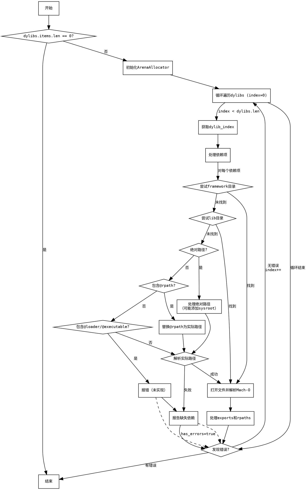

嗯，我现在需要理解这个用Zig编写的parseDependentDylibs函数，并为其绘制一个Graphviz的流程图。首先，我得通读代码，了解它的结构和逻辑流程。

函数开始于检查self.dylibs.items的长度是否为0，如果是的话直接返回。然后初始化一些变量，包括gpa、framework_dirs、lib_directories，以及一个arena_alloc的ArenaAllocator。接着进入一个循环，遍历每个dylib_index。

在循环内部，对于每个dylib，处理它的依赖项。这里有几个步骤：首先尝试在framework目录和lib目录中查找依赖的库，然后处理绝对路径和相对路径的情况，包括处理@rpath、@loader_path、@executable_path等路径变量。如果路径解析失败，会报告错误。

接下来，当找到依赖的路径后，会尝试打开文件，解析Mach-O头部，添加dylib或tbd文件。然后处理每个依赖项，检查是否需要提升（hoisted），并将导出和rpath添加到对应的umbrella中。

中间有一些错误处理的逻辑，比如has_errors标志位，当有错误时返回MissingLibraryDependencies错误。

现在需要将这些步骤转化为流程图。流程图应该包括开始和结束节点，条件判断（比如dylibs是否为空，路径是否存在，是否是绝对路径等），循环结构，以及各个处理步骤。可能的节点包括：

1. 开始节点。
2. 检查dylibs是否为空，如果是则结束。
3. 初始化变量，如arena_alloc等。
4. 进入循环遍历dylibs。
5. 对于每个dylib，处理其依赖项。
6. 处理不同的路径情况（框架目录、库目录、绝对路径、相对路径等）。
7. 错误处理，如路径不存在时报错。
8. 添加文件处理，解析Mach-O头部。
9. 处理依赖项的导出和rpath。
10. 循环结束，检查是否有错误，如果有则返回错误。

需要注意的是，循环结构中的处理步骤可能比较复杂，特别是路径解析部分的条件分支。可能需要使用条件判断节点（菱形）来表示不同的路径处理情况。同时，错误处理流程需要连接到错误收集节点，最后决定是否返回错误。

另外，函数中有多个嵌套的循环和条件判断，比如在for循环中处理每个依赖项id，每个id又可能有不同的路径处理方式。这需要在流程图中分层展示，避免过于拥挤。

可能的Graphviz结构如下：

digraph parseDependentDylibs {
    start [label="开始"];
    check_dylibs_empty [label="self.dylibs.items.len == 0?" shape=diamond];
    end [label="结束"];
    init_vars [label="初始化变量"];
    loop_start [label="循环遍历dylibs"];
    process_dylib [label="处理当前dylib"];
    handle_dependencies [label="处理每个依赖项"];
    check_absolute_path [label="路径是绝对路径？" shape=diamond];
    check_framework [label="在framework目录查找" shape=diamond];
    check_lib [label="在lib目录查找" shape=diamond];
    handle_absolute [label="处理绝对路径"];
    handle_relative [label="处理相对路径"];
    error_check [label="是否有错误？" shape=diamond];
    add_file [label="添加文件并解析"];
    process_exports [label="处理导出和rpath"];
    report_error [label="报告错误"];

    start -> check_dylibs_empty;
    check_dylibs_empty -> end [label="是"];
    check_dylibs_empty -> init_vars [label="否"];
    init_vars -> loop_start;
    loop_start -> process_dylib [label="下一个dylib"];
    process_dylib -> handle_dependencies;
    handle_dependencies -> check_absolute_path;
    check_absolute_path -> check_framework [label="否"];
    check_absolute_path -> handle_absolute [label="是"];
    check_framework -> check_lib [label="未找到"];
    check_framework -> add_file [label="找到"];
    check_lib -> handle_relative [label="未找到"];
    check_lib -> add_file [label="找到"];
    handle_absolute -> add_file;
    handle_relative -> add_file;
    add_file -> process_exports;
    process_exports -> error_check;
    error_check -> loop_start [label="继续"];
    error_check -> report_error [label="有错误"];
    report_error -> end;
}

不过，可能还需要细化每个条件分支，特别是处理@rpath、@loader_path等的路径替换部分。此外，错误处理可能在多个步骤中出现，比如在路径解析失败时设置has_errors，并在循环结束后统一检查。因此，流程图中的错误节点需要连接到各个可能出错的地方，并在最后统一处理。

可能需要在handle_dependencies的各个子步骤中添加错误处理路径，比如路径解析失败时跳转到错误收集节点。这可能需要更多的节点和连接线。

由于代码中存在多层循环（外层的while循环和内部的for循环），流程图可能需要嵌套的结构来表示内部循环的处理。不过，Graphviz不支持子图嵌套，所以可能需要用不同的节点来表示内部循环的步骤。

总结来说，流程图需要涵盖主要的分支和处理步骤，清晰地展示函数执行的各个可能路径，包括错误处理和循环遍历。需要注意条件的判断顺序以及各个处理步骤之间的依赖关系。
================================================

### 流程图说明：
1. **入口判断**：首先检查dylib列表是否为空，若为空直接结束。
2. **初始化内存管理**：使用ArenaAllocator管理临时内存。
3. **主循环**：遍历所有dylib，处理每个dylib的依赖项。
4. **依赖解析逻辑**：
   - 优先在framework目录搜索依赖项。
   - 其次在lib目录搜索。
   - 对绝对路径添加sysroot前缀并验证。
   - 处理@rpath替换逻辑。
   - 对@loader_path/@executable_path报错（代码中未实现）。
   - 最终尝试解析相对路径。
5. **错误处理**：若路径解析失败，标记错误并跳过当前依赖。
6. **文件处理**：成功找到依赖后，解析Mach-O文件并处理导出符号/rpaths。
7. **全局错误检查**：循环结束后，若有错误则终止整个流程。

箭头上的标签标注了关键条件分支，菱形节点表示条件判断，虚线表示隐式错误传递。