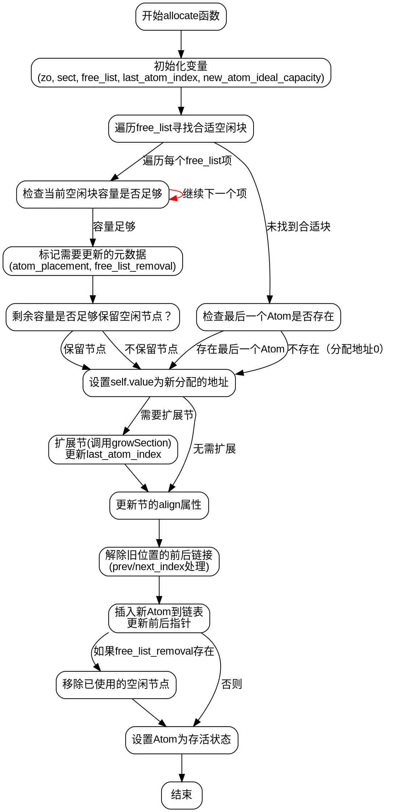

好，我需要为这个Zig语言写的allocate函数绘制流程图。首先，我得仔细阅读代码，理解每个步骤的逻辑。函数allocate的作用是为MachO文件中的Atom分配内存空间。首先，函数会获取一些初始信息，比如Zig对象、对应的节（section）、空闲列表（free list）等。然后，它尝试在空闲列表中找到合适的位置放置新的Atom。如果找不到，可能会扩展现有的节。

接下来，我需要分解函数的各个部分，识别主要的流程节点。比如：

1. 初始化变量，如zo、sect、free_list等。
2. 寻找合适的空闲块，这可能涉及循环遍历free_list。
3. 处理找到的空闲块，判断是否需要保留空闲节点。
4. 如果没有找到合适的空闲块，则考虑扩展节。
5. 更新节的元数据，比如对齐方式和大小。
6. 处理Atom的前后链接关系，维护链表结构。
7. 最后设置Atom为存活状态。

需要注意的是条件分支，比如是否找到空闲块，是否需要扩展节，以及如何处理前后的Atom链接。此外，日志记录和错误处理也是流程中的一部分，但可能不需要在流程图中详细体现。

画流程图的时候，应该使用图形化的方式展示这些步骤，用判断框表示条件分支，比如是否找到合适的空闲块，是否需要保留空闲节点等。同时，各个操作步骤用矩形框表示，箭头表示流程方向。

需要注意，函数中的一些操作是在循环中进行的，比如遍历free_list。这部分可能需要用循环结构来表示。另外，错误处理部分（try语句）可能涉及到提前返回，但根据代码中的注释，错误处理被推迟到函数末尾，所以可能在流程图中不需要单独处理错误路径。

最后，确保流程图符合Graphviz的语法，正确使用节点、边、条件判断等元素。可能需要将各个步骤模块化，保持流程图的清晰和可读性。
================================================
