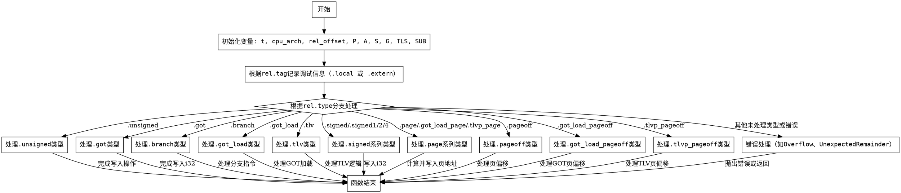

嗯，我需要为提供的Zig函数`resolveRelocInner`绘制一个流程图。首先，我得仔细阅读代码，理解它的结构和逻辑流程。这个函数处理重定位，根据不同的重定位类型执行不同的操作。流程图需要展示各个条件分支和处理步骤。

首先，函数开始执行，初始化一些变量，比如`t`、`cpu_arch`、`rel_offset`以及计算各种地址值（P、A、S、G、TLS、SUB）。然后根据`rel.tag`记录调试信息，不同的tag（如`.local`或`.extern`）会有不同的日志输出。

接下来是主要的处理部分，根据`rel.type`的不同执行不同的逻辑。例如，处理`.unsigned`、`.got`、`.branch`等类型。每个case内部可能有进一步的判断，比如检查`rel.meta.length`的值，或者根据`cpu_arch`执行不同的代码路径。

需要注意的是，有些case会调用其他模块的函数，比如`aarch64.writeBranchImm`或`x86_64.relaxGotLoad`，这些在流程图中可能需要简化为一个处理步骤。此外，错误处理部分，如`math.divExact`可能抛出错误，需要在流程图中体现可能的错误路径。

在绘制流程图时，应该使用条件判断节点来表示不同的`rel.type`分支，每个分支内部根据具体逻辑添加操作步骤。例如，处理`.unsigned`类型时，需要判断`rel.meta.length`是否为3或2，并执行相应的写入操作。对于`.branch`类型，需要根据不同的CPU架构（x86_64或aarch64）处理不同的分支逻辑。

另外，需要注意循环和递归的情况，不过在这个函数中似乎没有明显的循环结构，主要是顺序和条件分支。因此，流程图的结构应该是线性的，带有多个条件分支节点。

最后，确保所有可能的路径都被覆盖，包括错误处理路径，比如当`math.cast`返回`null`时抛出错误，或者`divExact`可能引发的错误。

总结步骤：
1. 函数开始，初始化变量。
2. 根据`rel.tag`记录调试信息。
3. 根据`rel.type`进入不同的处理分支。
4. 每个分支内部处理具体的逻辑，可能包含子条件判断。
5. 处理可能的错误情况。
6. 函数结束。

需要将这些步骤转化为Graphviz的节点和边，使用菱形表示条件判断，矩形表示操作步骤，箭头表示流程方向。同时，确保各个分支正确连接，不漏掉任何可能的路径。
================================================
