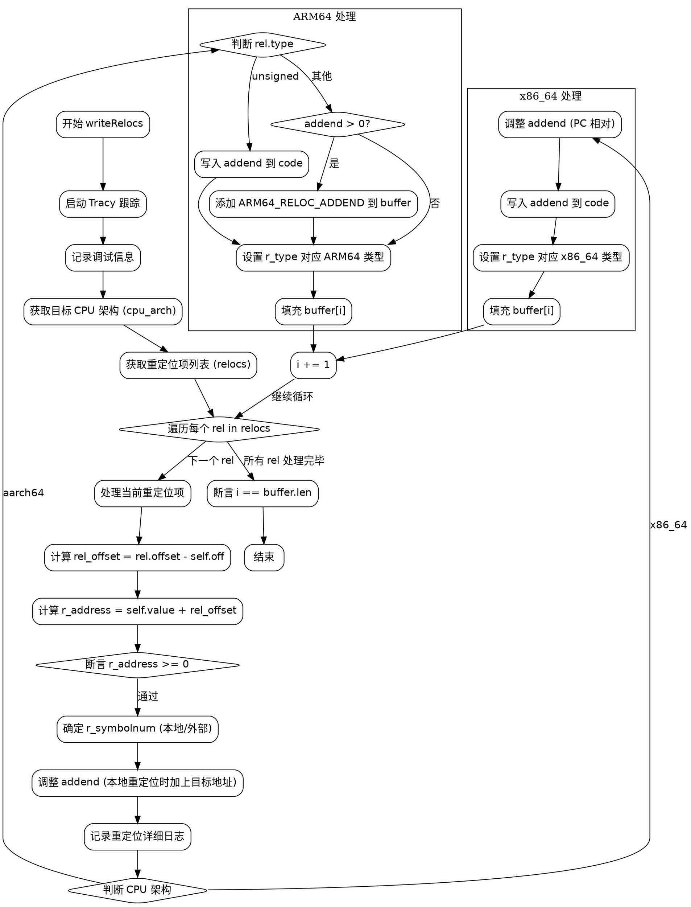

好的，我需要为提供的 Zig 函数 `writeRelocs` 绘制一个流程图。首先，我需要理解这个函数的结构和逻辑流程。

函数开始于声明一个 Tracy 跟踪块，然后记录调试信息。接下来，获取目标 CPU 架构和重定位信息。然后，遍历所有的重定位项（relocs），对每个重定位进行处理。

在处理每个重定位项时，首先计算 `rel_offset` 和 `r_address`，然后根据重定位的类型（本地或外部）确定 `r_symbolnum`。如果是本地重定位，还需要调整 `addend` 的值。之后，根据 CPU 架构（aarch64 或 x86_64）处理不同的重定位类型，写入相应的代码和缓冲区信息。

对于不同的架构，处理逻辑有所不同：ARM64 需要处理不同的重定位类型，并可能添加额外的重定位项；x86_64 需要调整 addend 的值，并根据重定位类型设置相应的参数。最后，确保处理的项数与缓冲区长度一致。

接下来，我需要将这些步骤转化为流程图的结构。流程图的起始节点是函数入口，然后是各个处理步骤，包括循环遍历重定位项，条件判断不同的 CPU 架构和重定位类型，以及对应的处理逻辑。每个条件分支需要分开表示，确保逻辑清晰。

需要注意的是，函数中有多个条件判断，比如 `switch (cpu_arch)` 和内部的 `switch (rel.type)`，这些都需要在流程图中用条件节点表示。循环部分（`for (relocs) |rel|`）需要循环结构的表示。

此外，错误处理和断言部分（如 `assert(r_address >= 0)` 和最后的 `assert(i == buffer.len)`）也需要在流程图中体现，可能作为判断节点。

最后，确保流程图符合 Graphviz 的语法，使用正确的节点和箭头表示流程顺序，合理分组不同架构的处理逻辑，避免交叉混乱。
================================================
