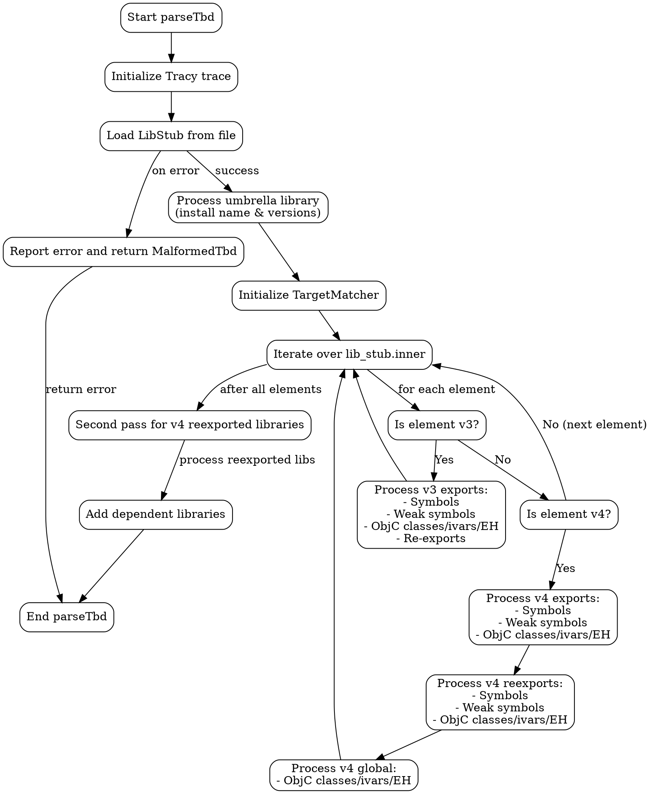

好的，我现在需要为给定的Zig函数`parseTbd`绘制一个流程图。首先，我需要仔细阅读并理解这个函数的逻辑。看起来这个函数是用来解析Mach-O动态库的TBD（Text-Based Stub）文件的。函数主要处理两种版本的TBD文件（v3和v4），提取导出符号、弱符号、Objective-C类等信息，并处理重新导出的库。

首先，函数开始时会初始化一些跟踪和日志记录。然后加载LibStub，处理安装名称和版本信息。接着，针对不同的TBD版本（v3和v4）分别处理导出项和重新导出项。对于v4，还会在后续处理中处理重新导出的库。最后，收集所有依赖项。

接下来，我需要将这些步骤分解成流程图中的各个节点。流程图的开始是函数入口，然后是各个步骤：初始化跟踪、加载LibStub、处理umbrella库的安装名称和版本、初始化目标匹配器、遍历每个库存根（处理v3和v4的不同部分）、处理重新导出的库（特别是v4的情况）等。需要注意条件判断，例如是否匹配目标架构，是否已经处理过某个库等。

需要注意的是，函数中存在多个循环和条件分支，例如处理exports、weak_symbols、objc_classes等部分时会有循环。此外，对于v3和v4的不同处理路径需要分开表示。最后，对于v4的重新导出库，需要单独的一个循环来处理。

在绘制流程图时，应使用适当的形状：矩形表示处理步骤，菱形表示条件判断，箭头表示流程方向。需要确保每个判断分支都正确连接，尤其是处理不同TBD版本时的不同逻辑。另外，函数中的错误处理部分（如捕获错误并报告）也需要在流程图中体现，可能作为终止节点或错误处理分支。

可能需要将大的循环结构简化，避免流程图过于复杂。例如，处理每个导出项的具体步骤可以用一个子流程或合并的节点来表示，而不是每个循环都展开。同时，需要注意函数中的延迟操作（defer）和资源释放，但可能在流程图中可以简化为一个步骤。

最后，需要确保流程图的逻辑顺序正确，从函数入口开始，按照代码执行顺序逐步展开，直到函数结束。检查是否有遗漏的步骤或判断条件，确保所有可能的执行路径都被覆盖。
================================================
