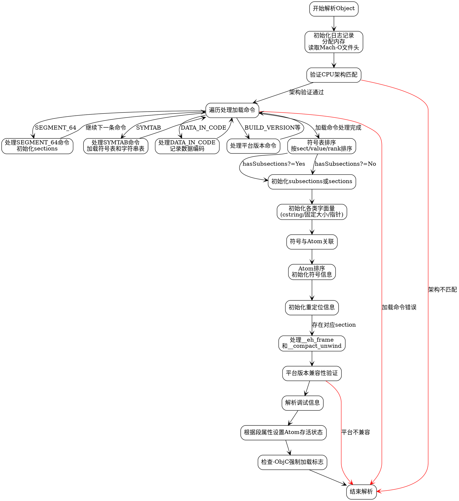

好的，我需要为给定的Zig函数`parse`绘制一个流程图。首先，我要仔细阅读这段代码，理解它的主要步骤和逻辑结构。

函数`parse`属于一个`Object`结构体的方法，接收一个`MachO`文件的指针。函数开始时会记录调试信息，检查CPU架构，解析Mach-O文件的头部和加载命令，处理符号表、数据、平台信息等，最后进行一些后处理，比如处理调试信息、ObjC强制加载等。

接下来，我需要将整个流程分解成主要的步骤：

1. **初始化和日志记录**：记录开始解析的日志，分配内存，读取Mach-O文件头。
2. **CPU架构检查**：验证目标CPU架构与文件头中的架构是否匹配。
3. **处理加载命令（Load Commands）**：遍历所有加载命令，处理不同类型的命令，如段（SEGMENT_64）、符号表（SYMTAB）、数据编码（DATA_IN_CODE）等。
4. **符号表排序和处理**：根据符号的不同属性进行排序，初始化子段（subsections）或普通段。
5. **字面量初始化**：处理c字符串、固定大小和指针字面量。
6. **符号与原子（Atom）关联**：将符号表条目链接到对应的原子。
7. **原子排序和符号初始化**：对原子进行排序，初始化符号和符号的stab信息。
8. **重定位初始化**：处理重定位信息。
9. **异常处理框架解析**：处理__eh_frame和__compact_unwind段。
10. **平台版本检查**：验证平台版本兼容性。
11. **调试信息解析**：解析调试信息。
12. **原子的存活状态设置**：根据段属性设置原子的存活状态。
13. **强制加载ObjC检查**：根据标志决定是否强制加载对象。

在绘制流程图时，需要注意各个步骤之间的顺序和条件分支，比如处理不同加载命令的分支、是否存在子段的条件判断、是否有异常处理段等。

使用Graphviz的DOT语言来描述流程图，每个主要步骤作为一个节点，条件判断用菱形节点表示，流程箭头表示执行顺序。确保节点之间的连接正确，特别是循环和条件分支部分。

需要特别注意处理加载命令的循环结构，遍历所有加载命令并根据类型处理。此外，符号排序和不同类型的初始化步骤也需要正确表示。

最后，检查是否有遗漏的步骤或错误的条件分支，确保流程图准确反映代码逻辑。
================================================
