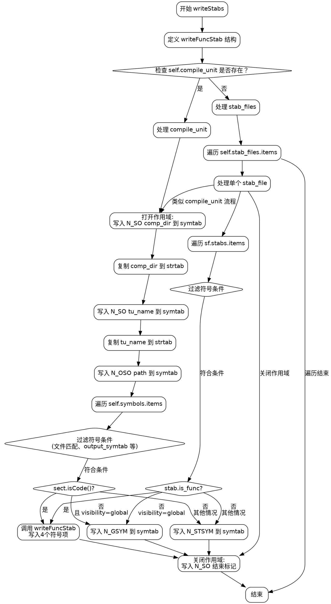

好的，我现在需要帮用户画一个使用Graphviz的流程图，函数是Zig语言写的writeStabs函数。首先，我需要理解这个函数的结构和流程。

首先，函数writeStabs的参数是self, stroff, macho_file, ctx。函数内部定义了一个writeFuncStab的内部结构，然后根据是否有一个compile_unit来分两种情况处理。如果有compile_unit，处理comp_dir和tu_name，然后处理符号；否则，处理stab_files中的每个文件。

我需要将整个函数的控制流分解成步骤，然后用Graphviz的节点和边表示出来。可能需要分几个大的分支，比如if (self.compile_unit)和else部分，然后每个部分内部还有循环，比如for符号和for stab_files。

接下来，我需要确定每个步骤的节点和它们之间的连接。例如，函数开始，检查是否有compile_unit，然后分别进入不同的处理块。每个处理块内部可能有打开作用域、处理路径、处理符号等步骤，然后关闭作用域。

需要注意的是，函数中有多个循环，比如for (self.symbols.items, 0..)和for (sf.stabs.items)，这些循环在流程图中需要用循环结构表示。同时，内部调用的writeFuncStab函数可能需要单独作为一个节点或子流程。

还要处理变量如index和n_strx的递增，以及条件判断，如sect.isCode()，sym.visibility等，这些会影响流程的分支。

在画图时，需要确保每个条件判断都有两个分支，每个循环有进入和退出点。可能还需要处理错误情况，比如assert(self.hasSymbolStabs())，但原函数中没有明显的错误处理流程。

最后，确保使用正确的Graphviz语法，用矩形框表示步骤，菱形表示条件判断，箭头表示流程方向。注意不要使用Mermaid语法，而是纯Graphviz的DOT语言。
================================================
