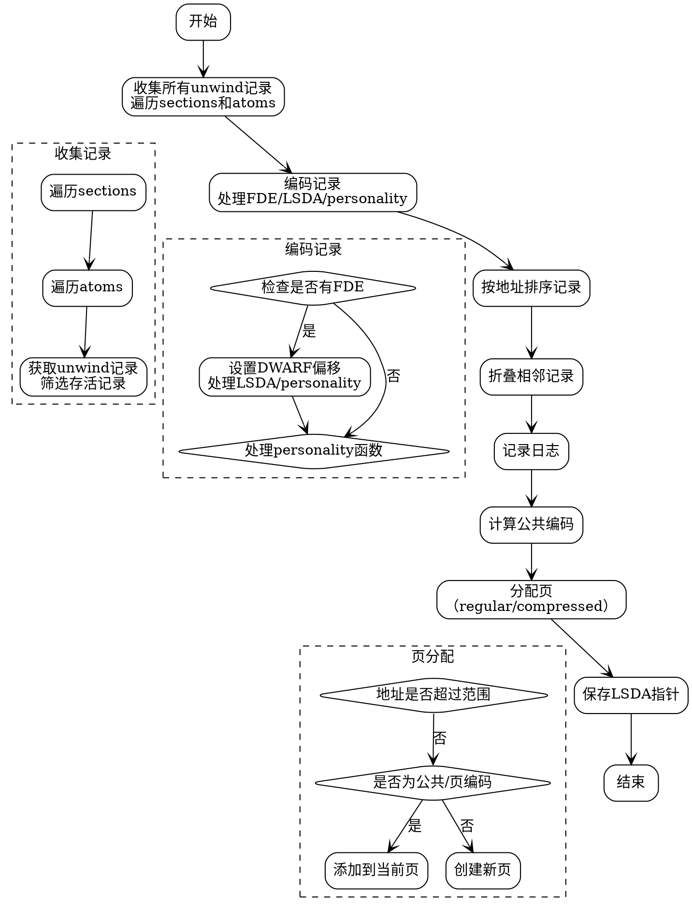

好，我需要为给定的Zig函数生成一个Graphviz流程图。首先，我得理解这个函数的结构和各个部分的功能。函数名为generate，属于UnwindInfo模块，主要处理MachO文件的展开信息生成。

首先，函数开始收集所有的展开记录（unwind records）。遍历MachO文件的各个section中的atoms，每个atom如果存活，则获取其unwind records，并将存活的记录添加到info.records中。这里可能需要处理内存分配，使用ensureUnusedCapacity来确保容量足够。

接下来是编码记录部分。对于每个记录，处理FDE（Frame Description Entry）的情况，设置Dwarf段偏移、处理LSDA（Language Specific Data Area）以及处理personality函数。如果有CIE（Common Information Entry）的personality，需要获取或插入对应的personality函数索引。

然后是对记录进行排序，根据它们在输出section中的相对地址排序。这里使用了自定义的排序函数sortFn，比较的是section编号和原子地址。

之后是折叠记录，将相邻且编码相同的记录合并。使用两个指针i和j遍历记录，检查是否可以折叠，如果可以，合并长度，否则保留当前记录。

记录日志部分，输出每个记录的地址范围、名称、记录索引、文件索引和编码。

计算公共编码（common encodings）部分，统计各编码的出现次数，排序后取出现次数多的作为公共编码，最多不超过max_common_encodings。

接下来是计算页分配（page allocations），根据记录的地址范围和编码类型，将记录分配到不同的页（regular或compressed），考虑每页的空间限制和编码数量限制。

最后，保存具有LSDA指针的记录，记录它们的索引到lsdas_lookup和lsdas数组中。

现在需要将这些步骤转化为流程图。需要注意各个步骤之间的顺序和条件判断。例如，收集记录后是编码处理，然后是排序、折叠、日志记录、计算公共编码、页分配，最后处理LSDA指针。

需要注意循环结构，如遍历sections和atoms，以及处理每个记录的循环。条件判断如检查是否存活、是否有FDE、是否可折叠等。此外，还有错误处理，比如try可能抛出错误，但在流程图中可能需要以条件分支表示。

Graphviz的节点应表示步骤，边表示流程顺序。可能需要使用子图来组织循环和条件判断。例如，收集记录部分包含两个嵌套循环，可以用循环结构表示。编码记录部分对每个记录进行不同的处理，可能涉及多个条件分支。

需要确保流程图的清晰，每个步骤对应一个节点，条件判断用菱形节点，循环用循环结构。由于代码中有多个循环和条件，需要合理布局，避免交叉和混乱。

可能的结构如下：

开始 -> 收集所有unwind记录 -> 编码记录 -> 排序 -> 折叠记录 -> 记录日志 -> 计算公共编码 -> 计算页分配 -> 保存LSDA指针 -> 结束。

在收集记录部分，内部有两个循环：遍历sections，然后遍历每个section中的atoms，再遍历每个atom的unwind records。需要将这些嵌套循环表示为子流程。

编码记录部分，对每个记录处理FDE、LSDA、personality，这部分可能有多个条件分支，如是否有FDE、是否有LSDA等。

计算公共编码部分，涉及统计和排序，需要循环遍历所有记录，统计编码出现次数，然后排序并选择前几个。

页分配部分，根据地址范围和编码类型，分页处理，可能涉及循环和条件判断，如是否达到页大小限制，是否属于压缩页等。

最后处理LSDA指针，遍历所有记录，记录有LSDA的索引。

需要注意，有些步骤可能并行或顺序执行，需要正确表示顺序。例如，编码记录必须在收集之后，排序在编码之后等。

可能的节点包括：

- 开始
- 收集unwind记录（遍历sections和atoms）
- 编码每个记录（处理FDE、LSDA、personality）
- 排序记录
- 折叠相邻记录
- 记录日志
- 统计公共编码
- 排序公共编码并选择前几个
- 分配页（处理页类型和记录）
- 保存LSDA指针
- 结束

每个步骤之间的箭头表示执行顺序。对于条件判断，如是否有FDE，使用菱形节点分出不同分支，但可能需要在流程图中简化，避免过于复杂。

由于Graphviz不支持子流程的嵌套，可能需要使用集群（cluster）来表示循环和条件部分。例如，将收集记录的循环作为一个集群，内部包含遍历sections和atoms的步骤。

最终，需要将上述步骤转换为Graphviz的dot语言，使用节点和边，合理组织布局，确保流程清晰可读。
================================================
