嗯，我需要为这个名为`flushStaticLib`的Zig函数绘制流程图。首先，我得仔细阅读代码，理解它的结构和工作流程。看起来这个函数的主要目的是处理静态库的生成，包括处理输入文件、解析对象文件、处理符号表、写入归档文件等步骤。

首先，函数开始于初始化一些变量，比如`gpa`和`diags`，然后创建一个`positionals`数组来收集所有的链接输入。接下来，它遍历`comp.c_object_table`和`module_obj_path`等，将各种对象文件添加到`positionals`中。这里需要注意条件判断，比如`comp.compiler_rt_strat`和`comp.ubsan_rt_strat`是否设置为`.obj`，这会影响是否添加对应的运行时对象文件。

之后，函数对每个输入文件进行分类，并处理可能出现的错误。如果有错误，就返回`LinkFailure`。然后调用`parseInputFilesAr`来解析输入文件，再次检查错误。

接下来，处理Zig生成的可重定位对象文件，解析符号，分配段和节，计算大小，创建段，分配内存，最后写入节内容。这里有很多步骤，比如`resolveSymbols`、`markExportsRelocatable`、`claimUnresolvedRelocatable`等，需要确保每个步骤都被正确表示。

然后，准备归档文件（`ar`）的结构，更新符号表`ar_symtab`，计算每个文件的偏移和总大小。这里涉及到对齐和不同文件类型的处理，比如`.zig_object`和`.object`。

最后，将所有内容写入缓冲区，调整对齐，处理可能的错误，并最终将缓冲区内容写入文件。整个过程需要确保所有步骤按顺序执行，错误处理得当。

在绘制流程图时，需要将这些步骤分解为不同的节点，并用箭头表示执行顺序。需要注意条件分支（如`if`语句）、循环（如`for`遍历数组）、错误处理（`try`和`catch`）以及可能的提前返回。此外，函数中有多个可能返回错误的地方，需要将这些错误处理路径也体现在流程图中。

可能的结构是：

1. 开始
2. 初始化变量（gpa, diags, positionals）
3. 收集所有输入文件到positionals（包括循环添加c_object_table、module_obj_path等）
4. 对每个输入文件进行分类，错误处理
5. 解析输入文件（parseInputFilesAr），错误检查
6. 处理Zig对象（如果有的话）
   a. 解析符号
   b. 标记导出
   c. 处理未解析的符号
   d. 排序节
   e. 添加原子到节
   f. 计算节大小
   g. 创建段
   h. 分配节内存
   i. 写入节内容
   j. 处理段名
   k. 写入加载命令和头
7. 收集所有文件索引
8. 更新归档符号表（ar_symtab）
9. 计算总大小和文件偏移
10. 写入归档内容到缓冲区（包括magic、symtab、对象文件）
11. 将缓冲区写入文件
12. 错误检查和返回

需要注意每个步骤之间的顺序，以及可能的条件分支。例如，在步骤3中，可能有多个条件判断来决定是否添加某些对象文件。在步骤6中，只有在存在Zig对象时才会执行子步骤a到k。

此外，错误处理部分需要使用菱形判断节点，比如在分类输入文件或写入归档时发生错误，立即返回LinkFailure。

可能需要使用不同的形状来表示不同的流程元素，比如矩形表示操作步骤，菱形表示条件判断，椭圆形表示开始和结束，箭头表示流程方向。

最后，确保流程图清晰展示函数的整体结构，包括主流程和错误处理路径，避免遗漏关键步骤。
================================================

```graphviz
digraph flushStaticLib {
    node [shape=rectangle];
    start [label="开始", shape=ellipse];
    end [label="结束", shape=ellipse];
    init_vars [label="初始化变量 (gpa, diags, positionals)"];
    collect_inputs [label="收集输入文件到 positionals\n（包括 c_object_table、module_obj_path 等）"];
    classify_inputs [label="对每个输入文件进行分类"];
    parse_files [label="解析输入文件 (parseInputFilesAr)"];
    handle_zig_object [label="处理 Zig 对象文件"];
    resolve_symbols [label="解析符号 (resolveSymbols)"];
    mark_exports [label="标记导出 (markExportsRelocatable)"];
    claim_unresolved [label="处理未解析符号 (claimUnresolvedRelocatable)"];
    sort_sections [label="排序节 (sortSections)"];
    add_atoms [label="添加原子到节 (addAtomsToSections)"];
    calc_sizes [label="计算节大小 (calcSectionSizes)"];
    create_segment [label="创建段 (createSegment)"];
    allocate_sections [label="分配节内存 (allocateSections)"];
    allocate_segment [label="分配段 (allocateSegment)"];
    write_sections [label="写入节内容 (writeSections)"];
    sanitize_sections [label="清理段名 (sanitizeZigSections)"];
    write_load_commands [label="写入加载命令 (writeLoadCommands)"];
    write_header [label="写入头 (writeHeader)"];
    collect_files [label="收集所有文件索引"];
    update_symtab [label="更新归档符号表 (ar_symtab)"];
    calculate_size [label="计算总大小和文件偏移"];
    write_archive [label="写入归档内容到缓冲区"];
    write_to_file [label="将缓冲区写入文件 (pwriteAll)"];
    error_check1 [label="检查错误", shape=diamond];
    error_check2 [label="检查错误", shape=diamond];
    error_check3 [label="检查错误", shape=diamond];
    error_check4 [label="检查错误", shape=diamond];
    error_link_failure [label="返回 LinkFailure", shape=ellipse];

    start -> init_vars;
    init_vars -> collect_inputs;
    collect_inputs -> classify_inputs;
    classify_inputs -> error_check1;
    error_check1 -> parse_files [label="无错误"];
    error_check1 -> error_link_failure [label="有错误"];
    parse_files -> error_check2;
    error_check2 -> handle_zig_object [label="无错误"];
    error_check2 -> error_link_failure [label="有错误"];
    handle_zig_object -> resolve_symbols;
    resolve_symbols -> mark_exports;
    mark_exports -> claim_unresolved;
    claim_unresolved -> sort_sections;
    sort_sections -> add_atoms;
    add_atoms -> calc_sizes;
    calc_sizes -> create_segment;
    create_segment -> allocate_sections;
    allocate_sections -> allocate_segment;
    allocate_segment -> write_sections;
    write_sections -> sanitize_sections;
    sanitize_sections -> write_load_commands;
    write_load_commands -> write_header;
    write_header -> collect_files;
    collect_files -> update_symtab;
    update_symtab -> calculate_size;
    calculate_size -> write_archive;
    write_archive -> error_check3;
    error_check3 -> write_to_file [label="无错误"];
    error_check3 -> error_link_failure [label="有错误"];
    write_to_file -> error_check4;
    error_check4 -> end [label="无错误"];
    error_check4 -> error_link_failure [label="有错误"];

    // 错误处理路径
    error_link_failure -> end [style=dotted];
}
```
