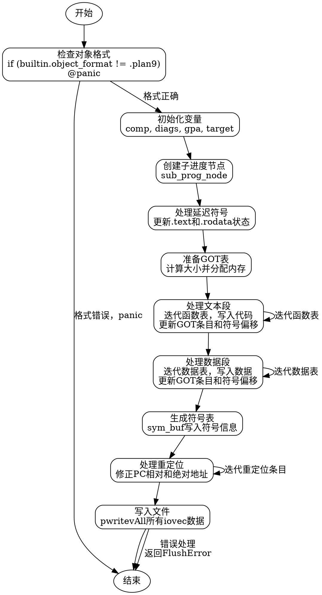

嗯，我需要为这个Zig函数`flushModule`画一个流程图。首先，我得仔细读一下代码，理解每个步骤的作用，然后分解成流程图中的各个节点。这个函数看起来是处理Plan9目标文件的模块刷新，涉及内存分配、符号处理、重定位等。

首先，函数开始有一些条件检查，比如检查是否跳过了非本地对象格式。接着初始化一些变量，比如`tracy`用于跟踪，`comp`获取编译信息。然后处理子进度节点，记录日志。之后激活PerThread，处理延迟符号，更新全局偏移表（GOT），处理文本和数据段，生成符号表，处理重定位，最后写入文件。

接下来，我需要确定每个主要步骤，并作为流程图的节点。例如：

1. 检查对象格式是否符合Plan9，否则panic。
2. 初始化跟踪和变量。
3. 处理延迟符号。
4. 准备GOT表。
5. 处理文本段（函数代码）和数据段（全局变量等）。
6. 生成符号表和行号信息。
7. 处理重定位信息。
8. 写入文件。

每个步骤可能会有子步骤，比如处理文本段时包括迭代函数导航表、处理每个函数的代码、更新GOT条目等。需要注意条件判断和循环结构，比如`if`语句和`while`循环。

在绘制流程图时，需要将这些步骤用适当的图形符号表示，比如开始/结束用椭圆形，处理步骤用矩形，判断用菱形，箭头表示流程方向。还要注意错误处理和资源释放，比如`defer`语句中的操作。

需要确保流程图的结构清晰，层次分明，不遗漏关键步骤。可能还需要将复杂部分拆分为子流程，比如处理文本段和数据段可以分别详细展开。同时，要注意函数中的错误处理路径，如`try`和`catch`，但在这个函数中错误处理可能通过返回错误码，需要在流程图中体现。

最后，根据代码中的各个部分，确定节点之间的连接关系，确保逻辑正确。比如，在初始化之后进入处理延迟符号，接着准备GOT，然后处理文本和数据，生成符号和行号信息，处理重定位，最后写入文件。如果有错误发生，流程可能提前终止或返回错误。
================================================
