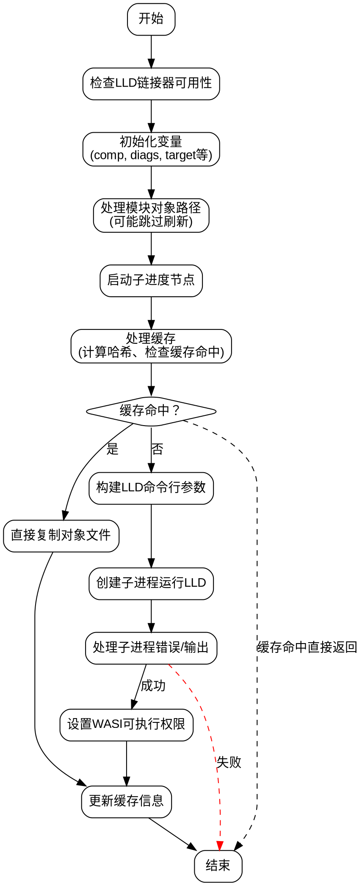

嗯，我需要帮用户将提供的Zig函数`linkWithLLD`转换成Graphviz的流程图。首先，我需要理解这个函数的结构和逻辑流程。

函数开头有一些变量声明和初始化，比如检查是否使用LLD链接器，获取编译配置和目标信息。然后处理模块对象路径，可能跳过输出文件的刷新。接着是进度节点的开始和结束。

接下来，函数处理缓存相关的逻辑，包括计算输入哈希、检查缓存命中情况。如果缓存命中，就直接返回；否则继续执行链接过程。这里需要注意条件判断，比如是否禁用LLD缓存，以及如何处理缓存未命中的情况。

然后，函数分为两种情况处理：生成目标文件（Obj）时进行简单的文件复制，或者使用wasm-ld进行链接。在链接过程中，构建命令行参数，调用LLD作为子进程执行链接操作。这里需要处理不同的编译配置选项，如优化级别、内存设置、导出符号等。

执行链接命令后，处理子进程的输出和错误，设置输出文件的执行权限（如果是WASI可执行文件），最后更新缓存信息。

画流程图时，需要将这些步骤分解成不同的节点，并用条件判断连接起来。比如，判断是否是生成目标文件、是否禁用缓存、缓存是否命中、是否是WASI可执行文件等。每个主要操作步骤（如文件复制、构建命令行参数、调用LLD、处理错误）都应该作为流程图的节点。

需要注意条件分支的正确连接，以及循环结构（比如处理链接输入的部分）。同时，确保流程图的连贯性，避免遗漏步骤或逻辑错误。最后，使用Graphviz的语法正确表示这些节点和边。
================================================
