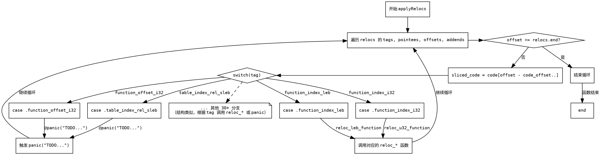

嗯，我需要为这个Zig函数生成一个Graphviz的流程图。首先，我得理解这个函数的结构。函数名是applyRelocs，参数包括code、code_offset、relocs和wasm。函数的主要逻辑是遍历relocs中的各个元素，然后根据不同的标签执行不同的操作。

首先，函数开始处有一个for循环，迭代四个数组：tags、pointees、offsets和addends。这些数组都是从relocs.slice获取的。然后，在循环内部，首先检查offset是否超过relocs.end，如果是的话就跳出循环。接着，sliced_code被定义为code的一个子切片，起始位置是offset - code_offset。

接下来是一个大的switch语句，根据不同的tag执行不同的reloc函数。很多case会调用相应的reloc函数，比如reloc_u32_function、reloc_leb_function等，还有一些case会触发panic，比如@panic("TODO...")。每个case处理不同的重定位类型，比如function_index_i32、function_index_leb等。

我需要把这些逻辑转化为流程图。流程图应该从函数入口开始，然后进入循环，检查offset是否超过end，如果是就结束循环。否则，处理sliced_code，然后根据不同的tag分支到不同的处理步骤。每个case对应一个处理分支，其中有些是已实现的，有些是未实现的（panic）。

需要注意的是，Graphviz的流程图使用节点和边来表示逻辑流程。我需要确定每个判断点和分支。例如，循环开始是一个节点，检查offset >= relocs.end是一个判断节点，如果是，则退出循环；否则进入处理流程。然后处理sliced_code，之后进入switch语句，每个case作为一个分支节点。

可能会有很多分支，因为switch有很多case。不过，为了简化，可以将switch作为一个判断节点，然后每个case作为不同的处理步骤，包括调用对应的reloc函数或者触发panic。但由于case很多，可能需要将相似的case分组，或者用注释说明各个分支。

另外，循环的结构需要正确表示，确保在每次迭代后回到循环的起始点，继续处理下一个元素。

总结一下，流程图的结构大致如下：

1. 函数开始
2. 进入循环，初始化迭代器
3. 检查offset >= relocs.end？如果是，结束循环；否则继续
4. 处理sliced_code
5. 根据tag进入不同的处理分支
6. 每个分支处理完后，回到循环开始处理下一个元素

需要注意的是，Graphviz中如何处理循环和分支结构，可能需要使用子图或者节点之间的连接箭头来表示循环。另外，由于switch有很多case，可能需要将这些case简化为一个节点，然后内部详细说明，或者分组处理，避免图形过于复杂。

可能还需要考虑错误处理，比如panic的情况，是否需要特别标记。

最后，确保使用正确的Graphviz语法，比如使用digraph，定义节点和边，使用条件判断的菱形节点等。
================================================

该流程图关键点说明：

1. **循环结构**：用 `loop_start` 和箭头回指表示迭代 relocs 的四个切片
2. **偏移检查**：菱形节点决定是否提前结束循环
3. **代码切片**：处理 code 的内存切片操作
4. **多路分支**：用 switch 的 30+ 分支简化为典型分支示例 + 注释节点
5. **统一出口**：所有分支处理完成后都会回到循环起点继续迭代
6. **错误处理**：用特殊节点标记未实现的 panic 分支

实际实现中每个 `tag` 对应一个独立分支节点，为简化展示用注释节点替代了重复结构。