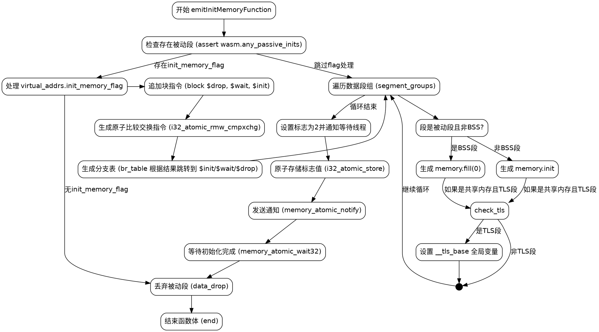

嗯，我需要根据提供的Zig代码来生成一个流程图。首先，我得仔细阅读这段代码，理解它的结构和工作流程。这个函数叫emitInitMemoryFunction，看起来是用来生成WebAssembly的内存初始化函数的。代码中有很多条件判断和循环，需要理清每个分支和步骤。

首先，函数开始时检查是否有被动段（passive segments），然后处理虚拟地址中的init_memory_flag。如果存在这个标志，会生成一些原子操作相关的字节码，包括块（block）、原子比较交换（atomic_rmw_cmpxchg）和分支表（br_table）。这部分可能涉及到多线程的初始化和同步。

接下来是处理数据段组（segment_groups）。对于每个段组，如果是被动段且不是BSS段，会生成memory.init或memory.fill指令。如果是共享内存且属于TLS段，还会设置全局变量__tls_base。

之后，如果存在init_memory_flag，会设置标志值为2，并通知等待的线程，可能涉及到原子存储（atomic_store）和通知（atomic_notify），然后处理等待（atomic_wait32）和分支跳转。

最后，对于每个被动段，如果不是BSS段且不属于TLS段，执行data_drop操作，结束函数体。

在画流程图时，需要将这些步骤按照执行顺序排列，并用条件判断来区分不同的分支。比如，处理init_memory_flag的部分是一个大的条件块，内部又有多个子步骤。处理segment_groups的循环需要表示多次迭代，每次迭代中根据段的属性执行不同的操作。

需要注意代码中的循环结构，比如for循环处理segment_groups，以及可能的条件判断如if (shared_memory and segment.isTls(wasm))等。每个条件判断都会导致不同的路径，需要正确地在流程图中体现出来。

可能还需要考虑异常处理和错误返回，但代码中使用的是Zig的错误处理（Allocator.Error!void），但流程图中可能不需要详细展示错误路径，除非对函数流程有影响。

总之，流程图需要从函数入口开始，按照代码的逻辑顺序，逐步展示各个条件分支、循环和操作步骤，确保每个可能的执行路径都被正确表示。
================================================

该流程图使用以下逻辑组织：
1. **入口点**和被动段检查
2. **标志处理**（包含原子操作和分支跳转）
3. **段处理循环**（根据类型生成不同指令）
4. **后处理阶段**（设置完成标志、通知等待者）
5. **段丢弃操作**和函数收尾

特殊符号说明：
- 菱形节点表示条件分支
- 圆形节点表示流程连接点
- 虚线表示隐式流程排序
- 关键WebAssembly指令用括号标注