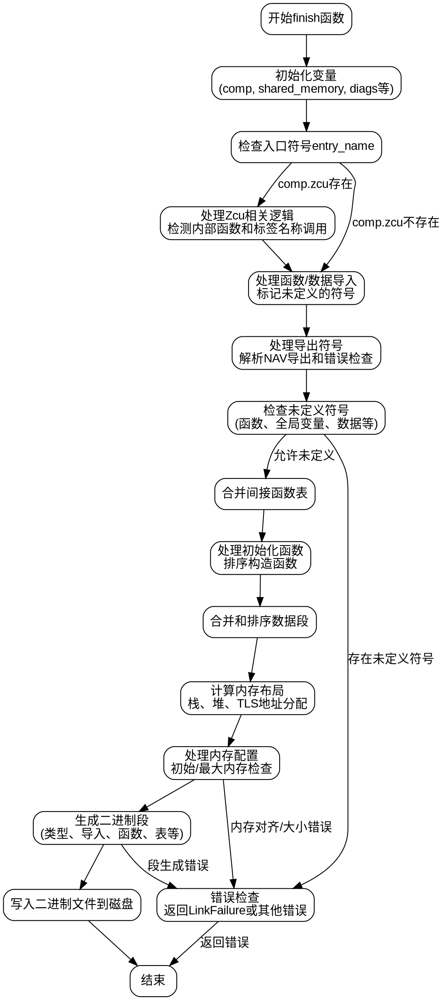

嗯，我需要为这个Zig函数`finish`画一个流程图。首先，我得仔细读一遍代码，理解它的主要步骤和逻辑结构。这个函数看起来是处理WebAssembly模块的链接和生成最终二进制文件的。

首先，函数开始部分有很多变量初始化，比如获取编译器配置、诊断信息、目标架构等。然后检查是否有入口点符号，处理各种导入和导出符号，包括函数、全局变量、数据等的导入和导出。

接下来，处理错误名称表和标签名称表，处理未定义的符号，合并间接函数表，处理初始化函数，合并和排序数据段，处理内存布局，包括栈、堆、TLS等的地址分配。

然后生成二进制文件的各个部分，比如类型段、导入段、函数段、表段、内存段、全局段、导出段、起始段、元素段、数据计数段、代码段、数据段等。最后处理调试信息和构建ID，并将生成的二进制内容写入文件。

流程图应该从函数开始，分步骤展示各个主要处理阶段，包括条件判断（如是否允许未定义符号，是否是对象文件等）、循环处理（如遍历导入、导出、数据段等）、错误处理，以及各个段的生成顺序。需要注意函数中的条件分支，如`if (comp.zcu)`、`if (!allow_undefined)`等，还有循环结构如`for`和`while`循环。

可能需要将流程分为几个主要部分：初始化、符号处理（导入/导出）、内存布局计算、段生成（类型、导入、函数等）、二进制内容生成、错误检查、写入文件。每个部分内部可能有子步骤和条件分支。

需要注意函数中的错误处理，比如`diags.addError`和返回错误，这些应该在流程图中体现为条件分支导致提前返回或终止。

最后，生成Graphviz的DOT语言代码，用节点表示步骤，边表示流程走向，条件分支用菱形节点，循环用适当的连接。
================================================
