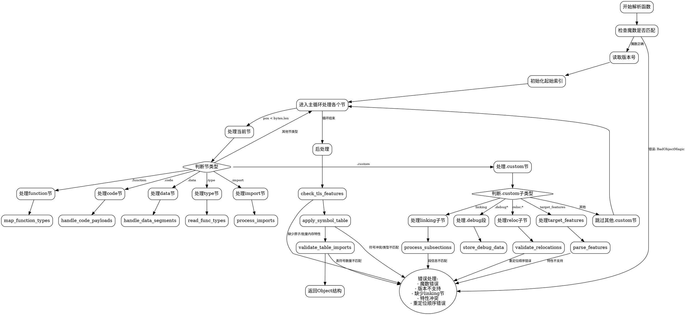

嗯，我需要为这个Zig编写的函数生成一个流程图。首先，我需要理解这个函数的结构和逻辑流程。这个函数名为`parse`，看起来是用来解析WebAssembly（Wasm）对象的。函数参数很多，包括指向Wasm结构的指针、字节切片、路径、存档成员名等等。返回类型是`anyerror!Object`，意味着可能会返回错误或者一个Object对象。

接下来，我需要逐行分析代码，识别主要的步骤和条件分支。首先，函数开始检查字节切片的前几个字节是否是Wasm的魔数（magic number），如果不是则返回错误。然后读取版本号，接着初始化一系列起始索引，比如数据段、自定义段、函数等的起始位置。

之后进入一个主循环，处理各个Wasm的节（section）。每个节都有一个标签，比如.custom、.type、.import等。每个节的处理逻辑不同，例如.custom节可能处理链接信息、重定位信息、目标特性等。在处理过程中，会有各种条件判断，比如是否遇到了链接节（linking section），是否支持某个版本等。

在处理不同的节时，会有许多子步骤，例如读取符号表、处理重定位、解析特性等。例如，在.custom节中，如果是"linking"子节，会处理段信息、初始化函数、comdat信息等。如果是"reloc."开头的子节，处理重定位信息。如果是"target_features"，则解析特性。其他如调试段（.debug）会被处理为自定义段。

在处理完所有节后，会进行一些后处理，比如检查TLS段是否支持所需特性，应用符号表信息到函数、全局变量等，处理导出信息，以及验证一些结构是否符合要求，比如函数表的存在性等。

最后，构造并返回一个Object结构，包含解析后的各种信息，如版本、路径、函数、导入、初始化函数等。

现在，我需要将这些步骤转化为流程图。流程图应该从函数入口开始，依次展示各个主要步骤，包括条件判断（如魔数检查、版本检查）、循环处理各个节，每个节内的处理逻辑，以及错误处理。需要特别注意循环结构（如处理每个节直到字节结束）、条件分支（如不同节类型的处理）、以及错误返回点。

可能的节点包括：

1. 开始
2. 检查魔数
3. 读取版本
4. 初始化起始索引
5. 进入主循环处理各个节
6. 处理每个节的类型（如.custom、.type等）
7. 处理.custom节的不同子类型（linking、reloc、target_features等）
8. 处理其他节（如.type、.import、.function等）
9. 后处理（应用符号表、检查特性、构造Object等）
10. 返回结果或错误

需要注意循环中的break和continue，以及可能的错误返回。例如，如果魔数不匹配，直接返回错误；如果缺少链接节，返回错误；在处理重定位时，如果顺序不对，返回错误等。

需要将这些步骤用graphviz的语法表示出来，使用节点和边连接，条件判断使用菱形节点，处理步骤用矩形节点，错误返回用边标注错误类型。

可能需要将主循环展开，显示循环内的处理流程，但考虑到代码长度，可能需要简化，用“处理每个节”的节点，并分支到各个节类型的处理。

最后，确保流程图的结构清晰，层次分明，能够反映代码的逻辑流程。
================================================

该流程图使用以下设计原则：
1. 使用矩形节点表示操作步骤
2. 菱形节点表示条件判断
3. 椭圆节点表示错误处理集群
4. 主流程从左到右垂直排列
5. 黄色箭头表示正常流程路径
6. 红色虚线表示错误路径
7. 通过rank=same保持同类节点对齐
8. 使用简明中文标签描述关键操作
9. 对复杂处理（如节类型判断）进行分层展开
10. 将重复的错误处理合并为集群节点