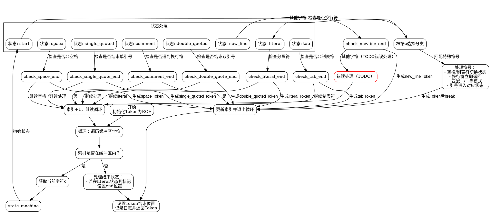

嗯，我需要根据提供的Zig代码绘制一个流程图。首先，我需要理解这个函数的结构和逻辑。这个函数是Tokenizer的next方法，用于生成下一个Token。看起来它通过不同的状态来处理字符，比如空格、注释、引号内的字符串等等。

首先，函数初始化了一个Token结构体，默认是eof。然后有一个状态机，初始状态是start。接下来进入一个循环，逐个字符处理缓冲区的内容。每个字符根据当前状态进入不同的处理分支。

例如，在start状态下，遇到空格会切换到space状态，遇到换行符则生成new_line的Token。遇到特定字符如"-"或"."会检查是否匹配更长的模式（如"---"或"..."），然后生成对应的Token。如果是其他字符，可能会进入literal状态。

接下来，不同的状态处理不同的情况。比如在comment状态下，只有遇到换行符或回车符才会结束注释Token。在单引号或双引号状态下，需要处理转义字符或结束引号的情况。literal状态则会在遇到特定分隔符时结束。

最后，当循环结束时，如果已经处理完所有字符，会根据当前状态确定最终的Token类型，比如如果还在literal状态，就标记为literal。

绘制流程图时，需要将各个状态之间的转换关系用箭头连接起来，每个状态内的处理逻辑也要体现在流程图中。例如，start状态下的各个字符判断，每个case对应的动作和状态切换。还要注意循环的结束条件，即当索引超过缓冲区长度时退出循环，并进行最后的处理。

需要注意不要遗漏任何状态转换，例如处理回车符后可能进入new_line状态，再处理换行符。此外，错误处理部分（如注释中的TODO）也需要在流程图中有所体现，比如未处理的情况可能需要标注为错误。

可能需要使用graphviz的节点和边来表示状态和转换，每个状态作为一个节点，字符处理作为边的条件。例如，start状态到space状态的边标注为“遇到空格”，而处理完Token后的break操作则指向结束节点。

最后，确保流程图的逻辑与代码完全一致，包括所有分支和可能的路径，避免错误或遗漏。
================================================

该流程图使用Graphviz的DOT语言描述，包含以下核心逻辑：
1. 初始化Token并进入主循环
2. 通过状态机处理不同字符场景
3. 特殊符号（如---/...）的匹配检测
4. 引号/注释/空格等状态的独立处理分支
5. 循环控制与索引管理
6. 最终Token的收尾处理
7. 未完成的错误处理标注（红色节点）

可以使用Graphviz工具（如dot命令或在线编辑器）渲染生成矢量图。每个状态转换路径都标注了对应的条件判断，关键Token生成点用break_loop节点统一处理。