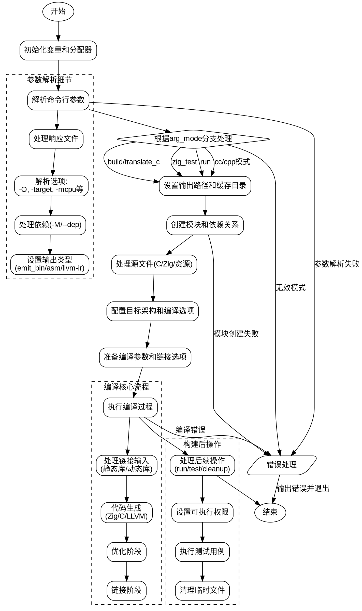

嗯，用户给了一个Zig语言写的函数buildOutputType，想让我用Graphviz画出它的流程图。首先，我需要理解这个函数的结构和逻辑流程，然后才能转化为流程图。

首先，我会大致浏览一下这个函数的代码。看起来这个函数非常长，处理了很多命令行参数，并根据不同的模式（如build、translate_c、zig_test等）进行不同的处理。函数里有很多变量声明和条件判断，可能涉及到不同的执行路径。

接下来，我需要确定函数的主要流程。函数开始处声明了很多变量，然后根据arg_mode的不同进入不同的分支。例如，当arg_mode是build、translate_c、zig_test或run时，处理命令行参数的方式不同。之后，函数处理各种命令行选项，设置不同的编译选项，比如目标架构、优化选项、输出类型等。

然后，函数创建模块（module），处理依赖关系，设置缓存目录，处理C源文件和资源文件，配置链接器选项，最后进行编译和可能的运行测试。

为了画流程图，我需要将函数分解成几个主要步骤：

1. 初始化和变量声明
2. 根据arg_mode进入不同的处理分支
3. 解析命令行参数，设置编译选项
4. 处理模块创建和依赖关系
5. 配置目标架构和编译选项
6. 处理输出文件路径和缓存目录
7. 执行编译过程
8. 处理测试或运行命令

在流程图中，每个步骤可能需要不同的节点，比如判断节点（菱形）、处理节点（矩形）、开始和结束节点（椭圆形）。由于函数中有很多条件分支，比如不同的arg_mode和不同的命令行参数选项，流程图会有很多分支。

需要注意的是，这个函数非常复杂，可能无法在流程图中详细展示每一个条件分支，但需要抓住主要流程。例如，处理不同的arg_mode分支，解析参数，创建模块，配置编译选项，最后编译或运行。

另外，函数中有很多错误处理，比如fatal函数调用，这些也需要在流程图中体现为错误处理的节点，可能导致流程终止。

可能的流程图结构如下：

开始 -> 初始化和变量声明 -> 判断arg_mode -> 不同分支处理 -> 解析命令行参数 -> 配置模块和选项 -> 处理输出和缓存 -> 执行编译 -> 处理测试/运行 -> 结束。

每个判断点需要分支，比如arg_mode的判断，不同命令行参数的解析路径等。错误处理部分可能需要指向错误终止节点。

由于代码非常长，可能需要简化，将复杂的条件分支合并为主要的步骤，避免流程图过于复杂难以阅读。

另外，需要注意函数中涉及的子流程，例如createModule、handleModArg等函数调用，可能在流程图中用单独的节点表示，或者作为子流程处理。

最终，流程图应清晰地展示函数的主要执行路径和关键决策点，帮助理解代码的结构和执行顺序。
================================================
