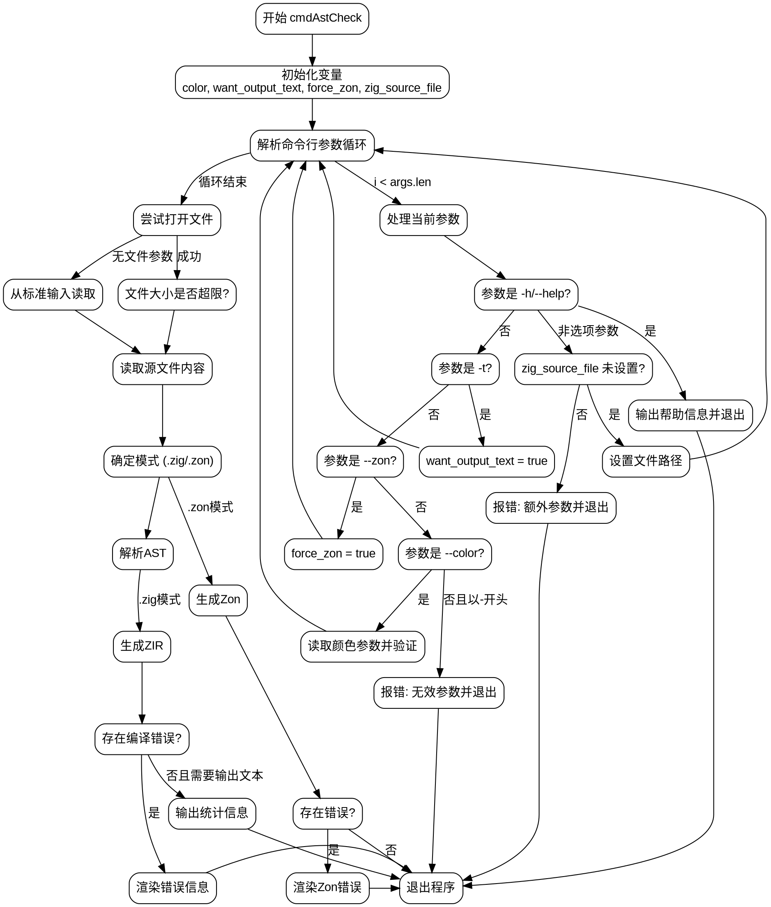

好的，我需要帮用户把提供的Zig代码中的cmdAstCheck函数用Graphviz画出流程图。首先，我得仔细阅读代码，理解函数的逻辑结构，然后分解成各个步骤和判断条件，再转化为流程图节点和边。

首先，函数cmdAstCheck的参数有三个：gpa、arena、args，返回一个错误联合的void。函数内部主要处理命令行参数，读取文件或标准输入，解析AST，生成ZIR或Zon，并根据不同模式处理输出。

接下来，函数的流程大致如下：
1. 检查开发模式。
2. 初始化变量，如color、want_output_text等。
3. 解析命令行参数，处理各种选项（如--help、-t、--color等）。
4. 确定输入源是文件还是标准输入，读取内容到file结构体。
5. 根据文件扩展名或参数确定模式（.zig或.zon）。
6. 解析AST，生成ZIR或Zon。
7. 处理错误，输出错误信息。
8. 根据参数决定是否输出文本统计信息。
9. 退出程序。

接下来需要将这些步骤转化为流程图节点。需要注意的是条件判断和循环结构，比如while循环处理参数，if-else判断不同的参数，以及模式选择后的不同处理分支。

可能的节点包括：
- 开始
- 初始化变量
- 循环处理参数
- 处理每个参数的条件分支（如--help、-t等）
- 读取文件或标准输入
- 确定模式
- 解析AST
- 生成ZIR/Zon
- 检查错误并输出
- 输出统计信息
- 退出

边需要连接这些节点，特别是条件分支后的不同路径。例如，当遇到--help时直接输出帮助信息并退出；遇到无效参数则报错退出；文件读取失败则报错等。

需要注意的是，Graphviz的语法需要正确使用节点和箭头，使用子图来处理循环和条件分支可能更清晰。比如，处理参数的循环可以用一个子图表示，内部包含各个参数判断的分支。

同时，需要处理错误路径，如fatal调用会导致进程退出，这些在流程图中应表示为终止节点。

可能遇到的挑战是如何简洁地表示复杂的逻辑分支，尤其是嵌套的条件和错误处理。需要确保每个条件判断都有明确的是/否分支，并且错误处理路径清晰。

最后，确保流程图不遗漏任何关键步骤，并且结构合理，易于理解。
================================================
