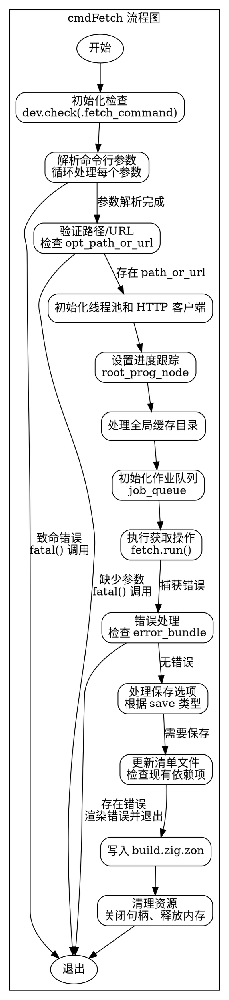

好的，我需要为给定的 Zig 函数 `cmdFetch` 生成一个流程图。首先，我需要仔细阅读代码，理解其逻辑结构和各个步骤。函数 `cmdFetch` 主要用于处理依赖项的获取和保存，包括解析命令行参数、处理全局缓存目录、执行获取操作、处理错误、保存依赖项到清单文件等。

首先，我会确定函数的主要步骤：

1. **初始化检查**：调用 `dev.check(.fetch_command)`，确保在正确的上下文中执行。
2. **解析命令行参数**：处理各种选项如 `--help`、`--global-cache-dir`、`--debug-hash`、`--save` 等。
3. **验证必要参数**：检查是否提供了路径或 URL。
4. **初始化线程池和 HTTP 客户端**：用于并发处理和网络请求。
5. **设置进度跟踪**：使用 `root_prog_node` 跟踪获取进度。
6. **处理全局缓存目录**：确定或创建全局缓存路径。
7. **初始化作业队列**：配置获取作业的参数。
8. **执行获取操作**：运行 `fetch.run()` 并处理可能的错误。
9. **处理错误包**：如果有错误，渲染并退出。
10. **处理保存选项**：根据 `--save` 或 `--save-exact` 参数保存依赖项到清单文件。
11. **更新清单文件**：修改 `build.zig.zon` 文件，添加或更新依赖项。
12. **退出处理**：清理资源并退出。

接下来，我需要将这些步骤转化为流程图中的节点，并用箭头表示控制流。需要注意的是，有些步骤可能有条件分支，比如解析参数时的不同选项，处理保存选项时的不同情况，以及错误处理路径。

需要注意的是，流程图应使用 Graphviz 的 DOT 语言，而不是 Mermaid。每个主要步骤应作为一个节点，条件判断使用菱形节点，流程箭头表示执行顺序。

例如，解析命令行参数时，可能需要循环处理每个参数，根据不同的参数设置不同的标志或变量。这部分可能需要一个循环结构，但在流程图中可以简化为一个节点，内部细节可能展开或合并处理。

在处理保存选项时，根据 `save` 变量的不同值（`.no`、`.yes`、`.exact`），流程会走向不同的路径，比如直接输出哈希值，或者更新清单文件。

在更新清单文件时，可能需要检查现有依赖项是否存在，决定是替换还是新增，这涉及条件判断。

最后，确保所有资源正确释放，如关闭目录句柄、释放内存等，在流程图中应有相应的清理步骤。

需要特别注意函数中的错误处理部分，如 `fatal` 调用会直接终止程序，这些应在流程图中体现为终止节点。

总结流程图结构：

- 开始
- 初始化检查
- 解析命令行参数
  - 处理每个参数，设置对应变量
- 检查路径或 URL 是否存在
- 初始化线程池和 HTTP 客户端
- 设置进度跟踪
- 处理全局缓存目录
- 初始化作业队列
- 执行获取操作
  - 成功或失败处理
- 检查错误包，若有错误则渲染并退出
- 处理保存选项
  - 根据保存类型更新清单文件
- 写入更新后的清单文件
- 清理资源
- 退出

在绘制流程图时，需要将这些步骤合理布局，使用正确的形状（如矩形表示操作，菱形表示判断），并用箭头连接顺序和条件分支。
================================================
