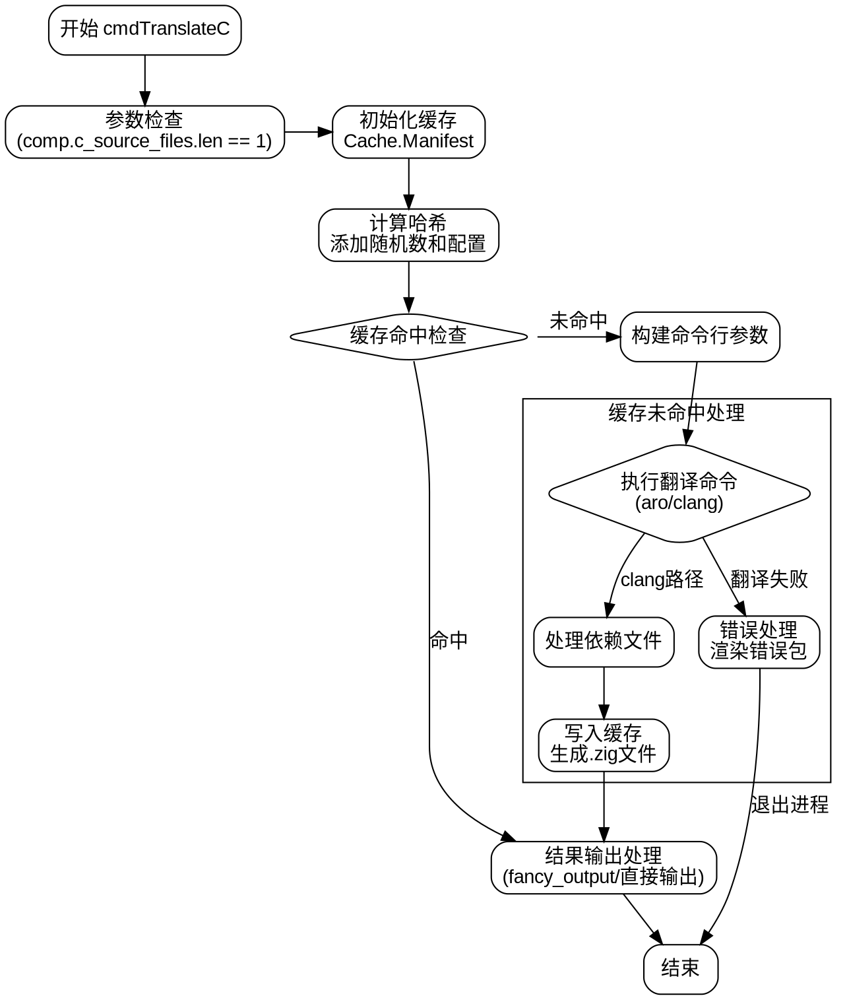

好的，我需要为给定的Zig函数`cmdTranslateC`绘制一个流程图。首先，我得仔细阅读并理解这段代码的功能和结构。看起来这个函数负责将C代码翻译成Zig代码，可能涉及到编译缓存、命令行参数处理、错误处理等步骤。

首先，函数开始部分有一些参数检查，比如`comp.c_source_files`的长度必须为1，并获取第一个C源文件。然后生成翻译后的Zig文件名，并初始化缓存相关的`Cache.Manifest`。这里可能需要处理缓存的命中或未命中情况。

接下来，如果缓存命中，直接使用已有的缓存结果；如果未命中，则需要调用不同的C前端（如aro或clang）进行实际的翻译工作。这部分涉及到构建命令行参数、执行外部命令、处理依赖文件等。特别是对于clang前端，还涉及到错误处理和生成错误包。

之后，处理翻译结果，无论是成功还是失败。成功的话将生成的Zig代码写入缓存目录，失败则处理错误信息并退出。最后，根据是否启用`fancy_output`来决定输出结果的方式。

在绘制流程图时，需要注意各个条件分支，如缓存是否命中、不同C前端的选择、错误处理路径等。每个主要步骤应作为流程图的节点，条件判断作为分支节点。同时，错误处理和资源释放（如关闭文件句柄）也需要在流程图中体现。

可能遇到的挑战是如何正确表示异步操作或资源管理（如`defer`语句），但流程图通常以顺序和条件分支为主，因此可以简化这些部分。确保每个关键步骤和决策点都有对应的节点，并且箭头正确连接各个步骤。

总结一下，流程图的大致结构可能是：

1. 函数开始
2. 参数检查与初始化
3. 检查缓存是否命中
   - 命中：获取缓存结果
   - 未命中：执行翻译过程
     a. 构建命令行参数
     b. 执行翻译命令（aro或clang）
     c. 处理依赖文件和错误
     d. 写入缓存
4. 处理结果输出
5. 结束

需要确保每个分支和步骤都清晰标注，特别是错误处理路径，如遇到错误时如何退出或报告。
================================================
