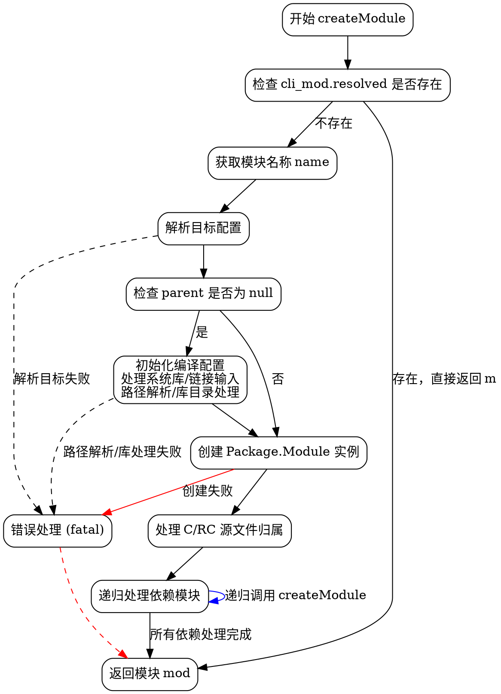

好的，我需要帮助用户将提供的Zig函数`createModule`转换为Graphviz的流程图。首先，我需要理解这个函数的结构和逻辑流程，这样才能准确地绘制出流程图。

首先，我会通读整个函数，识别主要的步骤和条件分支。函数`createModule`似乎是用来创建模块的，处理模块的依赖关系、目标解析、链接库的配置等。看起来函数内部有很多条件判断和循环，比如处理父模块的存在与否，处理不同的目标架构，处理链接输入等。

接下来，我需要分解函数的主要部分：

1. **参数检查与初始化**：检查`cli_mod.resolved`是否存在，如果存在则直接返回。
2. **目标解析**：根据父模块或默认值确定目标配置，处理LLVM参数，调整`target_mcpu`。
3. **父模块为空的处理**：初始化编译配置，处理系统库、链接输入、路径解析等。
4. **创建模块实例**：使用`Package.Module.create`创建模块实例，处理可能的错误。
5. **处理依赖模块**：递归调用`createModule`处理每个依赖项。

接下来，我需要将这些步骤转化为流程图的节点，并确定它们之间的逻辑流向。需要注意条件分支（如if语句）、循环（如for循环处理依赖项）、错误处理（fatal调用和错误返回）等。

可能的流程节点包括：
- 开始
- 检查cli_mod.resolved是否存在
- 解析目标配置
- 处理父模块为空的特殊逻辑
- 创建模块实例
- 处理C和RC源文件
- 递归处理依赖模块
- 错误处理节点
- 结束

在绘制流程图时，需要注意条件判断的分支，例如“if (parent == null)”会有不同的处理路径。同时，递归调用`createModule`处理依赖项的部分需要表示为一个循环或重复的流程。

另外，需要注意函数中的错误处理，例如调用`fatal`会导致流程终止，而返回错误码则会向上层传递错误。这些错误路径也应该在流程图中体现出来。

最后，确保使用Graphviz的正确语法，如使用正确的节点形状（矩形表示过程，菱形表示判断，椭圆形表示开始/结束等），箭头表示流程方向，标签清晰说明每个步骤。
================================================

该流程图使用以下约定：
- 矩形节点表示主要操作步骤
- 菱形节点表示条件判断
- 红色箭头表示错误处理路径
- 蓝色箭头表示递归调用
- 虚线箭头表示可能的异常流程
- 主要流程按从上到下顺序执行
- 包含关键错误处理分支（fatal调用）
- 突出显示了递归处理依赖模块的循环逻辑