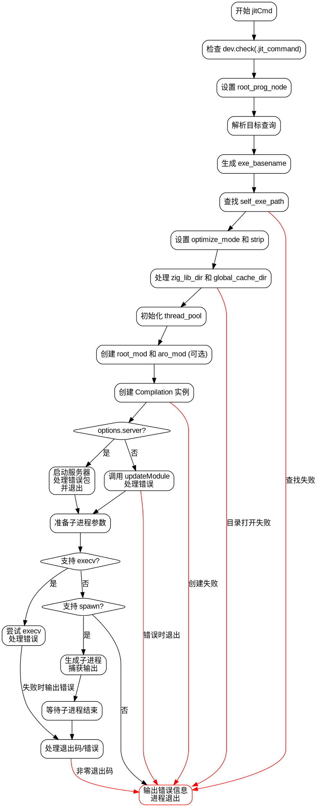

嗯，我现在需要为这个Zig写的函数画一个流程图。首先，我得仔细阅读这段代码，理解它的结构和逻辑流程。这个函数叫做jitCmd，看起来是处理一些编译和执行的流程。

首先，函数开始于一些初始化步骤，比如检查dev.check(.jit_command)，然后设置颜色和root_prog_node。接着处理目标查询，解析目标，生成exe_basename，确定emit_bin的位置。然后找到Zig的可执行路径self_exe_path，设置优化模式和strip选项，处理库目录和全局缓存目录。

接下来是线程池的初始化和一些模块的创建，比如root_mod和可能的aro_mod。之后创建编译配置config，然后创建Compilation实例comp。这里可能会有错误处理，如果出现错误，会调用fatal并退出。

然后根据是否启用服务器选项，进入不同的处理分支。如果启用了服务器，就启动服务器处理错误；否则调用updateModule。之后处理子进程的参数，准备执行子进程。如果支持execv，则尝试执行，否则检查是否可以生成子进程，并处理输出捕获。

最后等待子进程结束，处理退出码或错误情况。

接下来，我需要将这些步骤转化为流程图的结构。流程图的开始是函数入口，然后按照顺序处理各个步骤，包括条件判断（比如options.server是否存在，是否有错误发生等），循环可能较少，但需要处理不同的分支。

需要注意的是，流程图中需要包括错误处理路径，比如fatal调用后的退出，以及不同条件下的分支，比如是否启用服务器、是否捕获输出等。同时，子进程的执行部分也是一个重要的分支点，涉及execv和spawn的不同处理方式。

可能的结构是：开始 -> 初始化（目标查询、路径设置等） -> 模块和编译配置创建 -> 编译处理（分服务器和非服务器） -> 准备子进程参数 -> 执行子进程 -> 处理结果 -> 结束。

在画图时，需要用条件判断节点来表示不同的选项，比如if (options.server)，然后分支到不同的处理流程。错误处理部分需要连接到终止节点，表示进程退出。

另外，流程图中需要标注关键的函数调用和变量设置，比如Compilation.create、child.spawn()等，但不需要过于详细的代码，而是概括性的步骤。

最后，确保流程图符合Graphviz的语法，正确使用节点、边、条件判断框等元素，避免使用Mermaid的语法。
================================================


该流程图使用以下约定：
1. 菱形节点表示条件判断
2. 红色边表示错误处理路径
3. 关键操作使用简洁的英文描述
4. 遵循函数的主要执行路径和错误处理路径
5. 保持了模块创建、编译配置、子进程执行等关键阶段的逻辑顺序

可以通过Graphviz工具（如dot命令）渲染生成图片：
```bash
dot -Tpng jitcmd_flow.dot -o jitcmd_flow.png
```