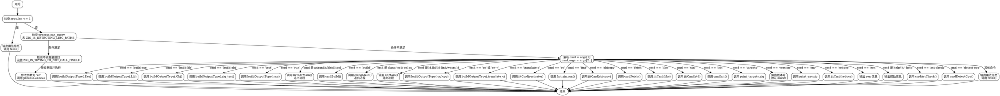

嗯，用户给了我一个Zig语言写的函数，想要用Graphviz画出流程图。首先，我需要理解这个函数的结构。看起来这是处理命令行参数的主函数，根据不同的命令调用不同的子模块。函数名是mainArgs，参数包括两个分配器和一个参数数组。

首先，函数开始的时候有一个tracy的跟踪，然后检查参数长度，如果不够就输出用法信息并报错。接下来处理环境变量相关的情况，特别是当Zig被误认为系统C编译器时的递归问题。这里有一个条件判断，如果环境变量存在，可能会执行execve来调用其他命令，比如将参数替换成"cc"。

然后，函数根据不同的命令参数（比如build-exe、test、run等）调用不同的函数，比如buildOutputType或者cmdBuild。每个命令对应一个处理分支，最后如果都不匹配就输出未知命令的错误。

为了画流程图，我需要把这些逻辑分支转化为节点和边。可能需要将主要的条件判断作为分支点，每个分支对应不同的处理过程。比如，检查args.len <=1 是一个判断节点，接着是处理环境变量的部分，再根据不同的cmd进入不同的处理流程。

需要注意的是，函数中有多个if-else if链，每个条件对应不同的命令，需要逐一处理。同时，有些命令会调用外部函数或者执行退出，这些应该作为流程图的终止节点。此外，错误处理部分如fatal也需要表示出来。

可能的结构是：

开始 -> 检查参数数量 -> 不足则输出用法并报错 -> 结束
足够则检查环境变量条件 -> 是则处理execve相关逻辑 -> 结束
否则解析命令 -> 根据不同的命令进入对应的处理分支 -> 各分支执行相应操作 -> 结束
未知命令则输出用法并报错 -> 结束

需要确保每个判断节点都有对应的分支，并且流程清晰。可能需要使用菱形表示判断节点，矩形表示处理步骤，箭头表示流程方向。同时注意循环或递归的情况，比如环境变量中的递归检测，需要正确表示其处理流程。

最后，生成正确的Graphviz代码，确保节点和边的正确连接，避免遗漏任何分支。可能需要多次检查代码逻辑，确保流程图准确反映函数的执行流程。
================================================
