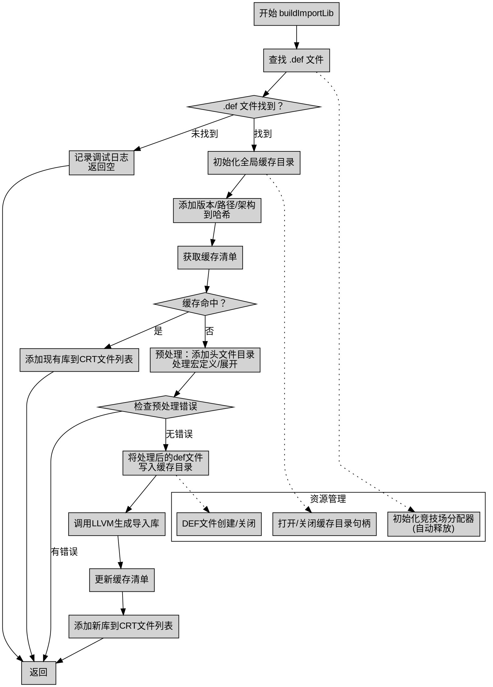

好的，我需要为这个Zig函数`buildImportLib`绘制流程图。首先，我得理解这个函数的结构和逻辑。

函数开始于检查是否存在`.def`文件。如果找不到，记录日志并返回。接下来，处理目标架构，初始化缓存，并添加各种路径前缀。然后计算哈希以确定是否需要重新生成库文件。

如果缓存命中，直接使用现有的库文件；否则，生成新的库。这里涉及到预处理器处理`.def`文件，处理宏定义，以及可能的错误处理。最后，使用LLVM生成导入库，并更新缓存。

需要注意条件分支，比如错误处理、缓存是否命中的不同路径。还要考虑循环和迭代部分，比如处理诊断信息。确保每个步骤都正确连接，特别是错误处理和资源释放部分，如`defer`语句。

可能需要将主要步骤分解为决策节点、处理块和结束点。例如，检查`.def`文件是否存在是一个决策点，之后分为两个分支。缓存命中与否是另一个决策点。预处理和LLVM生成库是主要处理块。错误处理需要单独的分支。

还要注意资源管理，如`arena_allocator`的初始化和释放，以及文件句柄的关闭。这些应该在流程图中体现为清理步骤，可能放在对应的处理块之后。

最后，确保流程图的逻辑清晰，步骤连贯，没有遗漏关键路径，特别是错误返回和正常执行路径的区分。
================================================
