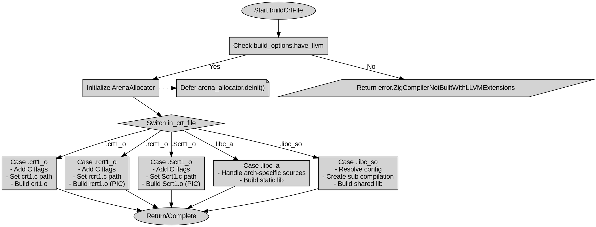

好的，我需要为给定的Zig函数`buildCrtFile`生成一个Graphviz流程图。首先，我需要仔细阅读并理解这个函数的逻辑结构。

函数开始检查`build_options.have_llvm`，如果不满足则返回错误。接下来初始化一个Arena分配器，并根据`in_crt_file`的不同分支处理不同的情况。每个分支（如`.crt1_o`、`.rcrt1_o`等）执行不同的操作，包括设置参数、添加源文件，并调用`comp.build_crt_file`或处理动态库的构建。

对于流程图，我应该从函数入口开始，然后根据不同的条件分支展开各个case。每个case内部的操作需要分解为步骤，例如初始化args列表、添加文件路径、调用构建函数等。特别是对于`.libc_a`和`.libc_so`这两个较为复杂的case，需要详细展示其内部处理流程，包括循环和条件判断。

需要注意的是，Graphviz使用节点和边来表示流程，每个条件分支应使用菱形节点表示判断，处理步骤用矩形节点，函数调用用椭圆节点等。同时，要确保流程图的逻辑顺序正确，避免遗漏任何重要的步骤或条件。

在绘制过程中，可能会遇到需要简化某些重复步骤的情况，比如多个case中的参数初始化部分，可以合并表示以提高可读性。另外，错误处理和资源释放（如`defer`语句）也需要在流程图中适当体现，例如在分配资源后立即标注释放操作。

最后，需要检查流程图的正确性，确保所有可能的执行路径都被覆盖，并且节点之间的连接准确无误。如果有不确定的部分，可能需要再次参考代码逻辑进行验证。
================================================
