好的，我需要为提供的Zig函数`print`生成一个Graphviz的流程图。首先，我需要理解这个函数的结构和逻辑流程。

首先，函数`print`接受多个参数，包括一个`Value`类型的`val`，一个`writer`，`level`，`pt`，和`opt_sema`。函数返回一个错误联合类型。函数的主要逻辑是基于`ip.indexToKey(val.toIntern())`的结果进行switch匹配，每个case处理不同的类型或值，并调用相应的打印方法。

接下来，我需要将每个switch分支转化为流程图中的节点。每个case对应一个处理步骤，例如处理`.int_type`、`.undef`、`.simple_value`等。需要注意的是，某些case内部还有嵌套的switch或条件判断，比如`.int`类型下的`switch (int.storage)`，或者`.enum_tag`中的条件判断`if (enum_type.tagValueIndex(...))`，这些都需要在流程图中体现出来。

另外，函数中有递归调用`print`的情况，比如在处理`.error_union`和`.opt`时，会递归调用自身。这在流程图中可能需要表示为循环或子流程节点。

需要注意异常处理和错误返回的情况，例如`try writer.writeAll(...)`可能抛出错误，但流程图中可能不需要详细展示错误处理，除非有特定的错误分支。

还需要考虑流程图的布局，确保各个分支清晰，连接线正确。可能需要将复杂的嵌套结构分解为子图，以保持可读性。

最后，根据Graphviz的语法，使用节点和边来表示各个步骤，使用条件判断来连接不同的分支。确保每个case和子条件都有对应的节点，并用箭头表示流程走向。

现在，我需要将这些逻辑转化为具体的Graphviz代码，确保每个分支正确，结构清晰。
================================================

```graphviz
digraph print_value_flow {
    node [shape=rectangle, style=rounded];

    start [label="Start print(val, writer, level, pt, opt_sema)"];
    end [label="End"];

    switch_ip_index [label="Switch ip.indexToKey(val.toIntern())"];
    type_cases [label="Type.print(val.toType(), writer, pt)"];
    undef [label="Write 'undefined'"];
    simple_value_switch [label="Switch simple_value"];
    variable [label="Write '(variable)'"];
    extern [label="Write extern name"];
    func [label="Write function name"];
    int_switch [label="Switch int.storage"];
    err [label="Write error.name"];
    error_union_switch [label="Switch error_union.val"];
    enum_literal [label="Write .enum_literal"];
    enum_tag [label="Process enum_tag"];
    empty_enum [label="Write '(empty enum value)'"];
    float [label="Write float value"];
    slice [label="Process slice"];
    ptr [label="Process ptr"];
    opt_switch [label="Switch opt.val"];
    aggregate [label="Process aggregate"];
    un_switch [label="Process union"];
    memoized_call [label="Unreachable (memoized_call)"];

    start -> switch_ip_index;

    switch_ip_index -> type_cases [label="int_type, ptr_type, ..."];
    switch_ip_index -> undef [label="undef"];
    switch_ip_index -> simple_value_switch [label="simple_value"];
    switch_ip_index -> variable [label="variable"];
    switch_ip_index -> extern [label="extern"];
    switch_ip_index -> func [label="func"];
    switch_ip_index -> int_switch [label="int"];
    switch_ip_index -> err [label="err"];
    switch_ip_index -> error_union_switch [label="error_union"];
    switch_ip_index -> enum_literal [label="enum_literal"];
    switch_ip_index -> enum_tag [label="enum_tag"];
    switch_ip_index -> empty_enum [label="empty_enum_value"];
    switch_ip_index -> float [label="float"];
    switch_ip_index -> slice [label="slice"];
    switch_ip_index -> ptr [label="ptr"];
    switch_ip_index -> opt_switch [label="opt"];
    switch_ip_index -> aggregate [label="aggregate"];
    switch_ip_index -> un_switch [label="un"];
    switch_ip_index -> memoized_call [label="memoized_call"];

    // Simple value sub-switch
    simple_value_switch -> write_void [label="void"];
    simple_value_switch -> write_empty_tuple [label="empty_tuple"];
    simple_value_switch -> write_tag_name [label="else"];
    write_void [label="Write '{}'"];
    write_empty_tuple [label="Write '.{}'"];
    write_tag_name [label="Write tag name"];

    // Int storage sub-switch
    int_switch -> write_number [label="u64/i64/big_int"];
    int_switch -> write_align [label="lazy_align"];
    int_switch -> write_size [label="lazy_size"];
    write_number [label="Write numeric value"];
    write_align [label="Write alignment"];
    write_size [label="Write size"];

    // Error union sub-switch
    error_union_switch -> write_err_name [label="err_name"];
    error_union_switch -> recurse_payload [label="payload"];
    recurse_payload [label="Recursive print(payload)"];

    // Enum tag logic
    enum_tag -> check_tag_index;
    check_tag_index [label="tagValueIndex found?" shape=diamond];
    check_tag_index -> write_enum_tag [label="Yes"];
    check_tag_index -> check_level [label="No"];
    write_enum_tag [label="Write .{tag_name}"];
    check_level [label="level == 0?" shape=diamond];
    check_level -> write_enumfromint [label="Yes"];
    check_level -> write_enumfromint_expr [label="No"];
    write_enumfromint [label="Write '@enumFromInt(...)'"];
    write_enumfromint_expr [label="Write '@enumFromInt(' + print(int) + ')'"];

    // Slice logic
    slice -> check_undef [label="Is ptr undef?"];
    check_undef [shape=diamond];
    check_undef -> write_empty_slice [label="Yes && len=0"];
    check_undef -> print_ptr [label="Yes && len≠0"];
    check_undef -> check_backing_addr [label="No"];
    write_empty_slice [label="Write '&.{}'"];
    print_ptr [label="Print ptr"];
    check_backing_addr [label="Check backing addr tag"];
    check_backing_addr -> print_ptr_contents [label="uav/comptime_alloc"];
    check_backing_addr -> print_ptr [label="nav/int"];
    print_ptr_contents [label="TODO: Load slice contents"];

    // Union logic
    un_switch -> check_union_tag [label="un.tag == .none?"];
    check_union_tag [shape=diamond];
    check_union_tag -> write_bitcast [label="Yes"];
    check_union_tag -> write_union_fields [label="No"];
    write_bitcast [label="Write '@bitCast(...)'"];
    write_union_fields [label="Write '.{ tag = val }'"];

    // Connect all terminal nodes to end
    type_cases -> end;
    undef -> end;
    write_void -> end;
    write_empty_tuple -> end;
    write_tag_name -> end;
    variable -> end;
    extern -> end;
    func -> end;
    write_number -> end;
    write_align -> end;
    write_size -> end;
    err -> end;
    write_err_name -> end;
    recurse_payload -> end;
    enum_literal -> end;
    write_enum_tag -> end;
    write_enumfromint -> end;
    write_enumfromint_expr -> end;
    empty_enum -> end;
    float -> end;
    write_empty_slice -> end;
    print_ptr -> end [label="After slice processing"];
    print_ptr_contents -> end [label="After slice processing"];
    ptr -> end;
    opt_switch -> end [label="none → 'null' | payload → print(payload)"];
    aggregate -> end;
    write_bitcast -> end;
    write_union_fields -> end;
    memoized_call -> end [label="Unreachable"];
}
```
