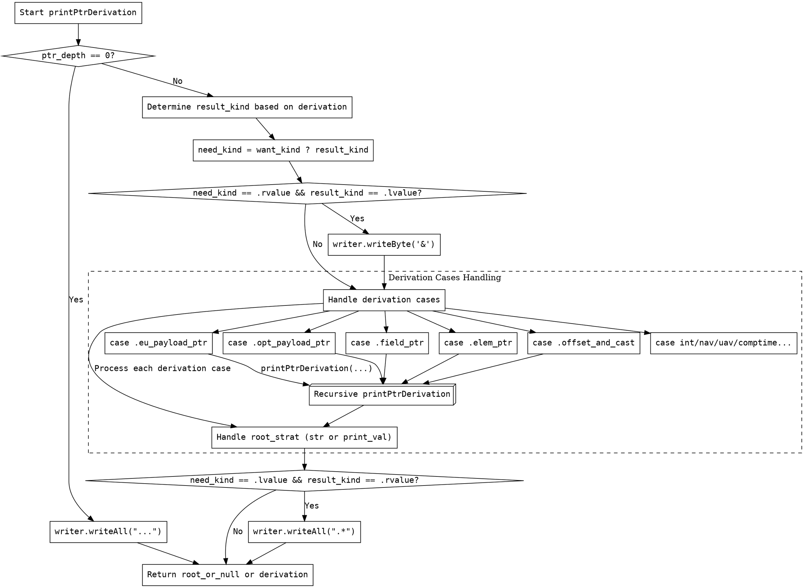

好的，我需要为这个Zig函数`printPtrDerivation`画一个流程图。首先，我得仔细阅读代码，理解它的逻辑结构和各个分支。

函数的主要参数包括`derivation`、`writer`、`pt`、`want_kind`、`root_strat`和`ptr_depth`。看起来它的作用是根据不同的指针派生步骤生成相应的字符串表示，并处理递归打印的情况。

首先，函数开始时检查`ptr_depth`是否为0，如果是，直接写入"..."并返回根步骤。这部分应该作为流程图的起点和第一个判断节点。

接下来，确定`result_kind`，根据`derivation`的不同类型，分为`.lvalue`或`.rvalue`。然后根据`want_kind`和`result_kind`决定是否需要添加`&`符号。

然后处理不同的`derivation`类型，例如`.eu_payload_ptr`、`.opt_payload_ptr`、`.field_ptr`等，每个类型有不同的处理逻辑，可能需要递归调用`printPtrDerivation`。这里会有多个分支，每个分支对应不同的处理步骤。

在处理完根步骤后，根据`root_strat`选择是直接写入字符串还是递归打印值。这部分可能涉及条件判断，比如`.str`或`.print_val`的不同处理方式。

最后，如果`need_kind`是`.lvalue`而`result_kind`是`.rvalue`，则添加`.*`后缀。

需要注意的是递归调用的部分，比如在处理`.field_ptr`时会再次调用`printPtrDerivation`，这时候流程图需要体现递归的结构，可能需要用子流程或者循环节点表示。

在画流程图时，应该用矩形表示处理步骤，菱形表示条件判断，箭头表示流程方向。每个主要的分支（如不同的`derivation`类型）都需要对应的判断和处理节点。同时，递归调用部分需要正确连接到之前的步骤，避免循环错误。

另外，要确保各个条件判断的逻辑正确，比如`ptr_depth`是否为0，`want_kind`是否为`null`，以及不同`root_strat`的处理方式。这些都需要在流程图中清晰体现。

最后，生成Graphviz的DOT代码时，要正确使用节点和边的语法，确保结构清晰，层次分明。
================================================
