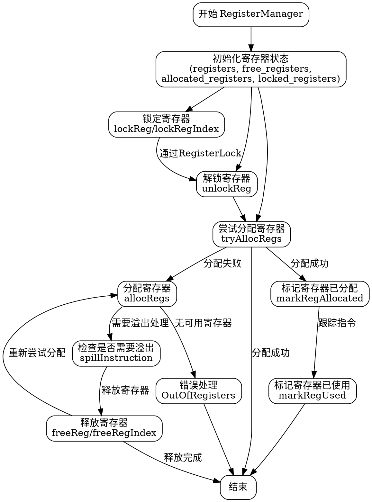

嗯，我需要为这个Zig代码中的RegisterManager函数绘制一个流程图。首先，我得理解这段代码的结构和主要功能。看起来这是一个用于管理寄存器的模块，包含分配、释放、锁定和解锁寄存器的功能。

首先，我应该确定主要的函数和方法。例如，tryAllocRegs、allocRegs、lockReg、unlockReg等。然后，考虑这些方法之间的调用关系和流程。比如，allocRegs可能会调用tryAllocRegs，如果失败则处理溢出。

接下来，需要理清各个条件判断，例如检查寄存器是否已锁定、是否空闲等。这些条件会影响流程的分支，比如在分配寄存器时，如果寄存器被锁定或已分配，可能需要不同的处理路径。

还要注意错误处理，比如当没有足够寄存器时返回错误。这部分应该在流程图中体现出来，比如从allocRegs到错误处理的路径。

然后，考虑循环结构，比如在tryAllocRegs中遍历可用的寄存器索引。这可能需要循环的表示。

此外，标记寄存器为已分配或已释放的方法（如markRegAllocated、markRegFree）也是流程中的关键步骤，需要在图中体现它们被调用的位置。

最后，确保流程图符合Graphviz的语法，使用正确的节点和箭头表示各个步骤和决策点。可能需要将复杂的逻辑分解成多个子图，以保持清晰。

需要检查是否有遗漏的重要步骤或条件，比如断言和日志记录，但可能不需要在流程图中详细展示每个日志调用，除非它们影响主要流程。

总结一下，流程图的步骤可能包括初始化寄存器状态、锁定/解锁处理、分配寄存器（尝试分配、处理溢出）、释放寄存器，以及错误处理路径。需要将这些步骤和决策点用Graphviz的语法正确连接起来。
================================================
