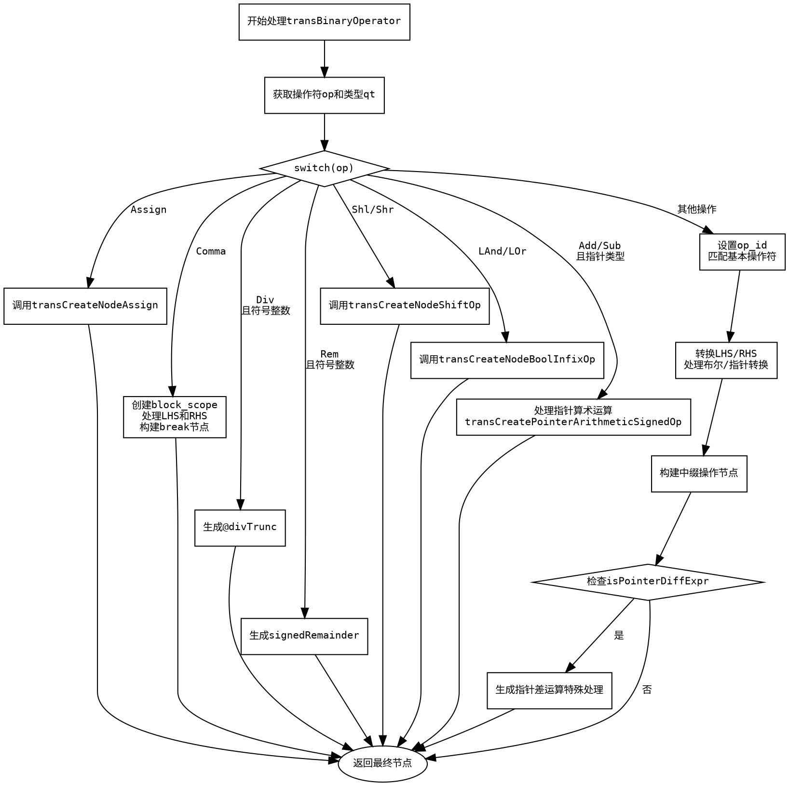

好的，我需要为给定的Zig函数`transBinaryOperator`生成一个流程图。首先，我需要理解这个函数的结构和逻辑流程。这个函数处理不同的二进制操作符，根据操作符类型和条件生成相应的Zig节点。

首先，函数接收一个Clang的二元操作符，然后根据操作符类型进入不同的分支。例如，如果是赋值操作（Assign），则调用`transCreateNodeAssign`；如果是逗号操作符（Comma），则创建块作用域并处理左右表达式。对于除法（Div）和取余（Rem），如果是符号整数，则使用特定的Zig函数（如`div_trunc`和`signed_remainder`）。移位操作（Shl、Shr）和逻辑操作（LAnd、LOr）也有对应的处理方式。

接下来，对于加减乘除等操作，根据操作数类型选择不同的Zig操作符（如`add_wrap`、`sub`等）。然后处理左右表达式，可能需要进行类型转换，最后生成对应的中缀操作节点。如果是指针差运算，还需要特殊处理，包括类型转换和大小计算。

在绘制流程图时，我需要将每个条件判断和处理分支可视化。例如，使用菱形表示条件判断（如操作符类型、是否为符号整数等），矩形表示处理步骤（如调用函数、创建节点等），箭头表示流程走向。需要注意处理异常情况和返回路径，确保所有可能的执行路径都被覆盖。

另外，要注意函数中的错误处理（如`try`和错误返回），虽然流程图中可能不详细展示错误路径，但主要逻辑需要清晰。还要处理变量的作用域，比如`block_scope`的初始化和释放。

最后，确保流程图符合Graphviz的语法，正确使用节点和边的定义，避免语法错误。可能需要将复杂的条件分支分解为多个节点，以保持图表清晰可读。
================================================
