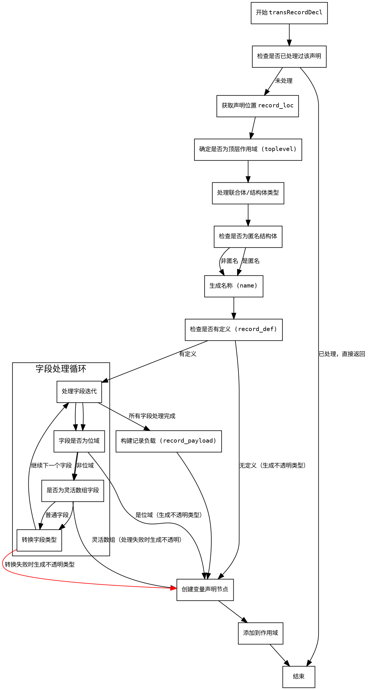

好的，我现在需要帮用户把给定的Zig函数`transRecordDecl`转换成Graphviz的流程图。首先，我需要理解这个函数的结构和逻辑流程。

首先，我会通读整个函数，了解每个部分的逻辑。函数的主要功能是处理C语言中的结构体或联合体声明，并将其转换为Zig的相应结构。函数开始时检查是否已经处理过该声明，避免重复处理。接着处理命名、匿名结构体/联合体，生成对应的名称，处理字段，包括位域、灵活数组成员等，最后构建Zig的AST节点并将其添加到作用域中。

接下来，我需要确定流程中的各个关键步骤和条件分支。例如：

1. 检查是否已处理过该声明，如果是则直接返回。
2. 确定是否为顶层作用域（toplevel）。
3. 处理结构体或联合体的类型，生成对应的名称。
4. 处理匿名结构体/联合体的命名。
5. 处理字段，包括检查位域、灵活数组，处理匿名字段等。
6. 构建AST节点，包括记录字段和函数。
7. 根据是否为顶层作用域，将生成的节点添加到不同的作用域中。

需要注意的是各个条件判断，比如是否为联合体、结构体，是否有匿名名称，是否遇到位域导致类型降级为不透明类型，灵活数组的处理等。每个条件分支都会影响流程的走向。

然后，我需要将这些步骤转化为流程图中的节点和边。每个判断条件对应一个菱形节点，不同的处理路径作为分支。例如，函数开始的检查是否已处理过声明，如果是则返回，否则继续。处理结构体或联合体类型时，根据类型选择不同的路径。处理字段时，循环遍历所有字段，每个字段可能有不同的处理逻辑，比如遇到位域则生成不透明类型，灵活数组需要特殊处理等。

此外，循环结构（如遍历字段的迭代器）需要在流程图中正确表示。对于错误处理和提前返回的情况，也需要在流程图中体现，例如遇到不支持的字段类型时，生成不透明类型并终止当前记录的处理。

最后，确保流程图的节点和边正确反映函数的控制流，没有遗漏重要的逻辑分支，并且结构清晰，便于理解。可能需要将复杂的部分拆分为子流程，但由于用户要求的是整个函数的流程图，需要保持整体结构的同时，详细展示主要步骤。
================================================

将此内容保存为`.dot`文件后，可用graphviz工具生成流程图。流程图关键特性：

1. 用菱形节点表示条件判断
2. 红色边表示错误处理路径
3. 黄色子流程框表示字段处理循环
4. 完整覆盖函数中的主要逻辑：
   - 重复声明检查
   - 匿名类型处理
   - 位域和灵活数组特殊处理
   - AST节点构建
   - 作用域添加逻辑