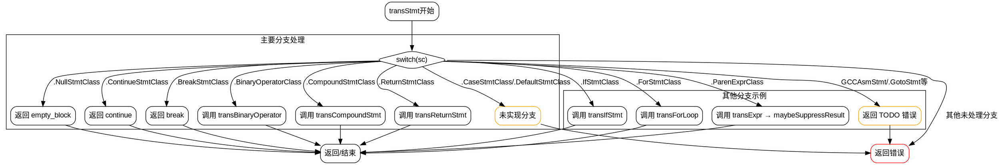

嗯，我现在需要帮用户用Graphviz画出一个Zig函数的流程图。用户提供的代码是transStmt函数，里面有一个很大的switch语句，处理不同的clang语句类型。我的任务是将这个函数的控制流可视化，使用Graphviz的DOT语言，而不是Mermaid。

首先，我需要理解这个函数的结构。函数transStmt接收一些参数，然后根据stmt的StmtClass（sc）进入不同的处理分支。每个case调用对应的transXXX函数，或者返回特定的节点，比如Tag.empty_block.init()，或者处理错误。

流程图应该从函数入口开始，然后根据不同的sc分支到不同的处理步骤，最后可能结束或返回错误。需要注意的是，有些case会直接返回，而有些可能会调用其他函数，这些调用是否需要体现在流程图中？用户可能希望展示主要的控制流分支，而不是每个函数调用的内部细节。

接下来，我需要确定如何将switch语句中的每个case转化为Graphviz的节点和边。每个case可以作为一个节点，指向对应的处理函数或返回语句。另外，最后的else和未处理的case需要作为错误处理节点。

可能的步骤：
1. 创建开始节点。
2. 判断sc的类型，每个case作为一个分支。
3. 每个分支连接到对应的处理动作。
4. 处理完后的共同出口，比如返回节点或错误处理。

需要注意，某些case可能直接返回，而其他可能需要进一步处理。例如，.NullStmtClass直接返回Tag.empty_block.init()，而.ParenExprClass需要调用transExpr，然后maybeSuppressResult。这些步骤是否需要分解成子节点？

另外，用户提到不要用Mermaid，所以必须确保生成的是正确的DOT语法。需要检查节点和边的连接是否正确，避免语法错误。

可能的结构：
- 开始节点 -> switch节点
- switch节点连接到各个case的处理节点
- 每个处理节点连接到结束或错误节点

对于错误处理，比如fail函数调用，应该有一个错误节点，多个case可能指向它。

现在需要列举所有case，并为每个case创建对应的节点。由于case很多，可能需要简化，比如将多个类似的case合并，例如.CaseStmtClass和.DefaultStmtClass都指向同一个错误节点。

还要注意注释中的部分，例如“When adding new cases here...”可能提示某些case未被处理，指向错误节点。

最后，确保图形布局合理，可能使用子图来组织switch结构，或者使用不同的颜色区分正常处理和错误路径。
================================================

这个流程图：
1. 使用菱形节点表示`switch(sc)`判断
2. 用橙色标注未完全实现的分支
3. 用红色标注错误返回路径
4. 用子图分组主要分支和其他分支
5. 保留了关键case（如BinaryOperator、NullStmt等）和典型处理模式
6. 展示了正常返回（end_node）和错误返回（error_node）两种最终状态
7. 使用`-> maybeSuppressResult`等标签表示链式调用关系

可以通过Graphviz工具（如dot命令或在线渲染）生成PNG/SVG等格式的流程图。实际使用时可以根据需要调整布局或添加更多具体分支的细节。