嗯，我需要帮用户用Graphviz画出这个Zig函数的流程图。首先，我得仔细看看这个函数的代码结构。这个函数transType的作用是根据不同的Clang类型类（TypeClass）进行转换，生成对应的Zig节点。

首先，函数开始有一个switch语句，根据ty.getTypeClass()的结果进入不同的分支。每个分支处理不同的类型，比如Builtin、FunctionProto、Pointer等。每个case里可能还有嵌套的条件判断或者函数调用，比如Builtin类型下又有根据builtin_ty.getKind()的switch。

接下来，我需要确定每个分支的逻辑流程。例如，处理Builtin类型时，会根据内置类型的种类返回不同的字符串；处理Pointer时，会检查指针指向的类型是否是函数原型或者其他条件，然后生成不同的指针类型节点。

考虑到流程图需要展示各个分支的走向，包括条件判断和可能的返回点。比如，在Pointer分支中，存在一个if条件判断is_fn_proto或者typeIsOpaque等，不同的条件会导致不同的返回路径（返回optional_type或c_pointer）。

另外，需要注意递归调用的情况，例如在Paren类型中，会递归调用transQualType，这可能在流程图中需要表示为子流程或者直接继续当前流程。

可能还需要处理错误情况，比如在Builtin类型的else分支中返回错误，或者在TypeOfExpr中处理可能的错误。

绘制流程图时，每个case应该作为一个节点，条件判断作为决策节点，不同的路径用箭头连接。例如，Builtin类型下，根据getKind()的不同结果，每个结果对应一个返回节点。对于复杂的case，如Pointer，可能需要分解为多个步骤：获取子类型、检查条件、生成指针类型等。

需要注意的是，Graphviz的语法需要正确的节点和边定义，避免循环或断开连接。可能需要将整个函数分解成多个子图，尤其是处理递归或深层嵌套的情况。

最后，确保所有的返回路径都被覆盖，包括错误处理和正常返回。每个case分支结束时都应有一个返回或继续处理其他节点的路径。
================================================

```dot
digraph transType_flowchart {
    graph [fontname="Arial", nodesep=0.5, ranksep=0.3];
    node [fontname="Arial", shape=box, style=filled, fillcolor="#f0f0f0"];
    edge [fontname="Arial"];

    start [label="Start transType", shape=ellipse, fillcolor="#c0ffc0"];
    end [label="Return Node", shape=ellipse, fillcolor="#ffc0c0"];
    error [label="Return Error", shape=ellipse, fillcolor="#ffc0c0"];

    start -> switch_type_class;

    subgraph cluster_main {
        label="Switch ty.getTypeClass()";

        switch_type_class [label="Switch Type Class", shape=diamond];
        switch_type_class -> builtin [label="Builtin"];
        switch_type_class -> function_proto [label="FunctionProto"];
        switch_type_class -> function_no_proto [label="FunctionNoProto"];
        switch_type_class -> paren [label="Paren"];
        switch_type_class -> pointer [label="Pointer"];
        switch_type_class -> const_array [label="ConstantArray"];
        switch_type_class -> incomplete_array [label="IncompleteArray"];
        switch_type_class -> typedef [label="Typedef"];
        switch_type_class -> record [label="Record"];
        switch_type_class -> enum [label="Enum"];
        switch_type_class -> elaborated [label="Elaborated"];
        switch_type_class -> decayed [label="Decayed"];
        switch_type_class -> attributed [label="Attributed"];
        switch_type_class -> macroqualified [label="MacroQualified"];
        switch_type_class -> type_of [label="TypeOf"];
        switch_type_class -> type_of_expr [label="TypeOfExpr"];
        switch_type_class -> vector [label="Vector"];
        switch_type_class -> bitint_extvector [label="BitInt/ExtVector"];
        switch_type_class -> default [label="else"];
    }

    builtin [label="Handle BuiltinType\nSwitch builtin_ty.getKind()", shape=diamond];
    builtin -> builtin_void [label="Void"];
    builtin -> builtin_bool [label="Bool"];
    builtin -> builtin_char [label="Char_U/UChar/..."];
    builtin -> builtin_schar [label="SChar"];
    builtin -> builtin_ushort [label="UShort"];
    builtin -> builtin_uint [label="UInt"];
    builtin -> builtin_ulong [label="ULong"];
    builtin -> builtin_ulonglong [label="ULongLong"];
    builtin -> builtin_short [label="Short"];
    builtin -> builtin_int [label="Int"];
    builtin -> builtin_long [label="Long"];
    builtin -> builtin_longlong [label="LongLong"];
    builtin -> builtin_uint128 [label="UInt128"];
    builtin -> builtin_int128 [label="Int128"];
    builtin -> builtin_float [label="Float"];
    builtin -> builtin_double [label="Double"];
    builtin -> builtin_float128 [label="Float128"];
    builtin -> builtin_float16 [label="Float16"];
    builtin -> builtin_longdouble [label="LongDouble"];
    builtin -> builtin_else [label="else"];

    builtin_void -> return_anyopaque;
    builtin_bool -> return_bool;
    builtin_char -> return_u8;
    builtin_schar -> return_i8;
    builtin_ushort -> return_c_ushort;
    builtin_uint -> return_c_uint;
    builtin_ulong -> return_c_ulong;
    builtin_ulonglong -> return_c_ulonglong;
    builtin_short -> return_c_short;
    builtin_int -> return_c_int;
    builtin_long -> return_c_long;
    builtin_longlong -> return_c_longlong;
    builtin_uint128 -> return_u128;
    builtin_int128 -> return_i128;
    builtin_float -> return_f32;
    builtin_double -> return_f64;
    builtin_float128 -> return_f128;
    builtin_float16 -> return_f16;
    builtin_longdouble -> return_c_longdouble;
    builtin_else -> error;

    function_proto [label="Call transFnProto()\nReturn Node.initPayload()"];
    function_proto -> end;

    function_no_proto [label="Call transFnNoProto()\nReturn Node.initPayload()"];
    function_no_proto -> end;

    paren [label="Recurse transQualType()"];
    paren -> end;

    pointer [label="Get child_qt\nCheck is_fn_proto/opaque"];
    pointer -> pointer_cond1 [label="Check conditions"];
    pointer_cond1 [shape=diamond, label="is_fn_proto ||\ntypeIsOpaque() ||\ndemotedToOpaque"];
    pointer_cond1 -> ptr_optional [label="Yes"];
    pointer_cond1 -> ptr_c_pointer [label="No"];
    ptr_optional [label="Create single_pointer\n+ optional_type"];
    ptr_optional -> end;
    ptr_c_pointer [label="Create c_pointer"];
    ptr_c_pointer -> end;

    const_array [label="Get size/elem_type\nCreate array_type"];
    const_array -> end;

    incomplete_array [label="Create c_pointer\nwith elem_type"];
    incomplete_array -> end;

    typedef [label="Check builtin_typedef_map\nCall transTypeDef()"];
    typedef -> end;

    record [label="Call transRecordDecl()\nReturn identifier"];
    record -> end;

    enum [label="Call transEnumDecl()\nReturn identifier"];
    enum -> end;

    elaborated [label="Recurse transQualType()"];
    elaborated -> end;

    decayed [label="Recurse transQualType()"];
    decayed -> end;

    attributed [label="Recurse transQualType()"];
    attributed -> end;

    macroqualified [label="Recurse transQualType()"];
    macroqualified -> end;

    type_of [label="Recurse transQualType()"];
    type_of -> end;

    type_of_expr [label="Translate underlying_expr\nCheck errors"];
    type_of_expr -> type_of_expr_ok [label="Success"];
    type_of_expr -> error [label="Error"];
    type_of_expr_ok [label="Create typeof node"];
    type_of_expr_ok -> end;

    vector [label="Create vector\nwith num_elements/elem_type"];
    vector -> end;

    bitint_extvector [label="Return TODO error"];
    bitint_extvector -> error;

    default [label="Return unsupported\ntype error"];
    default -> error;

    // Return nodes
    return_anyopaque [label="Return 'anyopaque'"];
    return_anyopaque -> end;
    return_bool [label="Return 'bool'"];
    return_bool -> end;
    return_u8 [label="Return 'u8'"];
    return_u8 -> end;
    return_i8 [label="Return 'i8'"];
    return_i8 -> end;
    return_c_ushort [label="Return 'c_ushort'"];
    return_c_ushort -> end;
    return_c_uint [label="Return 'c_uint'"];
    return_c_uint -> end;
    return_c_ulong [label="Return 'c_ulong'"];
    return_c_ulong -> end;
    return_c_ulonglong [label="Return 'c_ulonglong'"];
    return_c_ulonglong -> end;
    return_c_short [label="Return 'c_short'"];
    return_c_short -> end;
    return_c_int [label="Return 'c_int'"];
    return_c_int -> end;
    return_c_long [label="Return 'c_long'"];
    return_c_long -> end;
    return_c_longlong [label="Return 'c_longlong'"];
    return_c_longlong -> end;
    return_u128 [label="Return 'u128'"];
    return_u128 -> end;
    return_i128 [label="Return 'i128'"];
    return_i128 -> end;
    return_f32 [label="Return 'f32'"];
    return_f32 -> end;
    return_f64 [label="Return 'f64'"];
    return_f64 -> end;
    return_f128 [label="Return 'f128'"];
    return_f128 -> end;
    return_f16 [label="Return 'f16'"];
    return_f16 -> end;
    return_c_longdouble [label="Return 'c_longdouble'"];
    return_c_longdouble -> end;
}
```
