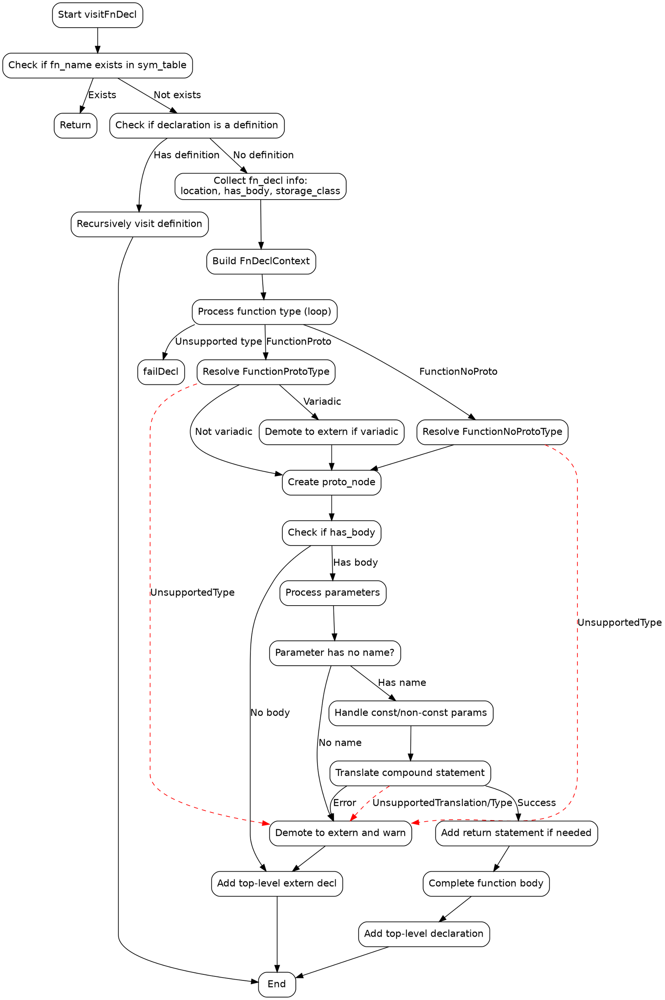

好的，我需要为提供的Zig函数绘制一个流程图。首先，我需要仔细阅读代码，理解其逻辑结构。这个函数`visitFnDecl`处理函数声明，包括检查是否已处理过、处理函数类型、参数、生成原型节点，以及处理函数体等步骤。

首先，函数开始时会获取函数名，并检查是否已经存在于符号表中，如果存在则直接返回。接下来，如果当前声明不是定义，而存在定义的话，会递归处理定义。

然后，处理函数的存储类、内联属性等，构建`FnDeclContext`结构。接着，处理函数类型，解析返回类型和参数类型，可能会遇到各种类型（如AttributedType、ParenType等），需要循环处理直到得到基本函数类型。

之后，根据函数类型（FunctionProto或FunctionNoProto）生成原型节点。如果有可变参数，会调整上下文属性并发出警告。如果处理过程中遇到不支持的类型，会报错并返回。

如果没有函数体，直接添加顶层声明。如果有函数体，则处理参数，生成参数名，处理常量性，可能重命名参数以避免冲突。然后处理函数体中的复合语句，如果转换失败，则降级为extern声明。

最后，检查是否需要添加返回语句，处理可能的noreturn情况，完成函数体的生成，并添加顶层声明。

现在需要将这些步骤转化为流程图。流程图应包含开始节点、结束节点，以及各个条件判断和处理步骤。需要注意循环结构（如处理函数类型的循环）和条件分支（如是否已处理、是否有函数体、参数是否有名称等）。

需要确保流程图的每个判断和处理步骤正确对应代码中的逻辑，并且流程清晰，无遗漏步骤。同时，要正确使用graphviz的语法，节点和边的连接要准确。
================================================

这个流程图使用Graphviz语法绘制，展示了以下关键流程：

1. 初始检查和递归处理定义
2. 函数类型解析（支持原型/无原型函数）
3. 参数处理和错误降级逻辑
4. 函数体转换和返回语句补充
5. 最终声明生成

红色虚线表示错误处理路径，黑色实线表示正常流程。每个菱形节点代表条件判断，矩形节点代表处理步骤，圆角矩形表示开始/结束节点。