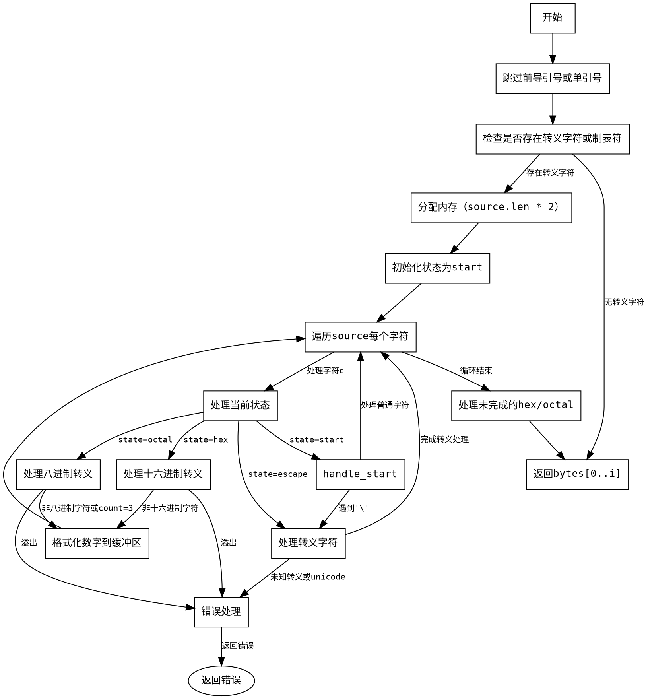

好的，我现在需要分析用户提供的Zig代码，并生成对应的流程图。用户要求使用Graphviz，而不是Mermaid，所以我需要确保使用正确的语法。

首先，我需要理解这个函数的功能。函数名为zigifyEscapeSequences，看起来是处理转义序列的。代码中有多个状态（start, escape, hex, octal），所以状态机可能是流程图的关键部分。

接下来，我需要逐行分析代码，确定主要的控制流。函数开始处理source字符串，寻找引号，然后检查是否有转义字符或制表符。如果没有，直接返回source。否则，分配内存进行处理。

然后，代码进入一个循环，遍历每个字符，根据不同的状态进行处理。状态包括start、escape、hex、octal。每个状态下有不同的处理逻辑，比如遇到'\t'会替换为"\\t"，遇到'\\'进入escape状态，处理各种转义字符，包括十六进制和八进制的情况。

在画流程图时，应该从函数入口开始，逐步展示各个步骤和判断条件。可能的节点包括：

1. 初始化变量，处理source的前导引号。
2. 检查是否存在转义字符或制表符，决定是否继续处理。
3. 进入主循环，遍历每个字符。
4. 根据当前状态处理字符，转换到不同的状态或处理转义序列。
5. 处理可能的错误情况，如无效的转义序列。
6. 最终处理未完成的十六进制或八进制数值，返回结果。

需要注意的是状态之间的转换条件，比如遇到反斜杠进入escape状态，处理完特定字符后回到start状态。同时，错误处理部分需要明确标出，比如遇到未知转义序列或溢出时的错误返回。

可能的结构是：

- 开始节点
- 处理前导引号
- 检查是否需要处理转义
- 主循环开始
  - 根据当前状态分支处理
  - 各状态内的逻辑和转换
- 结束处理，返回结果或错误

需要确保所有可能的路径都被覆盖，包括正常流程和错误退出。可能需要多个判断框和状态节点，以及连接它们的箭头，标注条件或操作。

最后，用Graphviz的DOT语言将这些逻辑结构转化为图形元素，比如节点、边、标签等。确保节点之间的流向正确，状态转换清晰可读。
================================================
