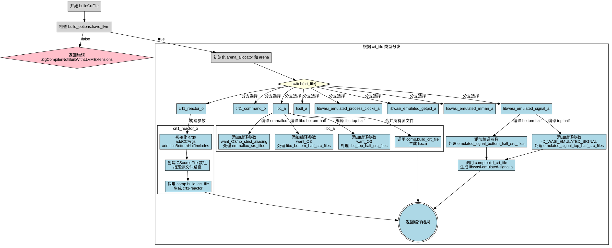

好的，我需要为这个Zig函数`buildCrtFile`生成一个Graphviz的流程图。首先，我要理解这个函数的结构和各个部分之间的关系。

函数开始时检查`build_options.have_llvm`，如果没有的话返回错误。然后初始化一些内存分配器，接着根据`crt_file`的不同类型进行处理。每个`case`里面会有不同的操作，比如构建参数、添加源文件、调用`comp.build_crt_file`等。

流程图应该从函数入口开始，分支处理不同的`crt_file`情况。每个情况内部可能会有子步骤，比如初始化参数、添加包含路径、处理多个源文件等。需要注意的是，有些情况如`libc_a`有多个子部分（emmalloc、libc-bottom-half、libc-top-half），这些都需要在流程图中体现出来。

另外，每个case最后都会调用`comp.build_crt_file`，所以这个步骤可能是共同的结束点。但根据不同的情况，参数会不同，比如输出文件名和类型。

需要确保每个分支正确连接，没有遗漏任何步骤，并且正确反映代码中的逻辑结构。可能需要用不同的节点和子图来表示各个case的内部流程。同时，注意错误处理的部分，即一开始的LLVM检查失败的情况。

现在开始绘制流程图，使用Graphviz的语法，定义各个节点和连接线。不同的case用不同的子图或节点来表示，确保结构清晰。
================================================
