嗯，我需要用Graphviz来画这个Zig函数的流程图。首先，我要理解这个函数的结构。函数是`pub fn option`，它处理不同类型的构建选项，比如布尔值、整数、枚举等。看起来有很多switch语句，根据不同的类型ID进行不同的处理。

首先，我应该确定函数的主要流程。函数开始处有一些初始化步骤，比如复制名称和描述，检查类型是否为枚举，然后生成可用选项列表。之后，根据类型ID的不同，进入不同的处理分支。

接下来，我需要将每个分支转化为流程图中的节点和判断框。例如，对于`type_id`的判断，可能会有多个分支：bool、int、float、enum、string等等。每个分支内部可能还有进一步的判断，比如处理标量值或列表值。

需要注意的是，函数中有很多错误处理的情况，比如类型不匹配时记录错误并标记无效输入。这些错误处理流程也需要在图表中体现出来。

另外，函数中有一些重复的结构，比如对于不同的类型ID，处理方式类似，但具体细节不同。需要确保每个分支都被正确表示，同时保持图表的简洁性。

可能还需要考虑循环结构，比如在处理列表类型时，可能会遍历列表项并进行验证。这时候可能需要循环节点。

最后，要确保流程图的箭头正确连接各个步骤，包括正常流程和错误处理流程。可能需要使用菱形框表示判断，矩形框表示操作步骤，平行四边形框表示输入输出等。

在绘制时，要注意Graphviz的语法结构，正确使用节点和边的定义。可能需要将整个函数分解成多个子图，以提高可读性。

总之，我需要仔细分析函数的每个部分，将其分解成逻辑块，然后逐步转换为Graphviz的节点和边，确保所有可能的分支和错误处理都被正确表示。
================================================

```dot
digraph flowchart {
    node [fontname="Helvetica", shape=rect, style="rounded"];
    edge [fontname="Helvetica"];

    start [label="Start: option()", shape=ellipse];
    dup_names [label="Duplicate name and description"];
    check_type [label="Check type_id", shape=diamond];
    enum_processing [label="Generate enum options list"];
    add_available_option [label="Add AvailableOption to map/list"];
    check_option_ptr [label="Check user_input_options.getPtr(name)", shape=diamond];
    return_null [label="Return null", shape=ellipse];
    process_type [label="Process based on type_id", shape=diamond];
    error_handling [label="Log error\nMark invalid input", shape=rect];

    // Main flow
    start -> dup_names;
    dup_names -> check_type;

    // Enum processing branch
    check_type -> enum_processing [label="type_id is enum/enum_list"];
    enum_processing -> add_available_option;

    // Non-enum processing
    check_type -> add_available_option [label="Other types"];
    
    // Common flow after type check
    add_available_option -> check_option_ptr;
    check_option_ptr -> return_null [label="Not found"];
    check_option_ptr -> process_type [label="Found"];

    // Type processing branches
    process_type -> bool_handling [label="bool"];
    process_type -> int_handling [label="int"];
    process_type -> float_handling [label="float"];
    process_type -> enum_handling [label="enum"];
    process_type -> string_handling [label="string"];
    process_type -> list_handling [label="list"];
    process_type -> enum_list_handling [label="enum_list"];
    process_type -> lazy_path_handling [label="lazy_path"];
    process_type -> lazy_path_list_handling [label="lazy_path_list"];
    process_type -> build_id_handling [label="build_id"];

    // Generic error handling
    bool_handling -> error_handling [label="Invalid type"];
    int_handling -> error_handling [label="Invalid type"];
    float_handling -> error_handling [label="Invalid type"];
    enum_handling -> error_handling [label="Invalid value"];
    string_handling -> error_handling [label="Invalid type"];
    list_handling -> error_handling [label="Invalid type"];
    enum_list_handling -> error_handling [label="Invalid value"];
    lazy_path_handling -> error_handling [label="Invalid type"];
    lazy_path_list_handling -> error_handling [label="Invalid type"];
    build_id_handling -> error_handling [label="Parse error"];
    error_handling -> return_null;

    // Successful returns
    bool_handling -> return_bool [label="Valid bool"];
    int_handling -> return_int [label="Valid int"];
    float_handling -> return_float [label="Valid float"];
    enum_handling -> return_enum [label="Valid enum"];
    string_handling -> return_string [label="Valid string"];
    list_handling -> return_list [label="Valid list"];
    enum_list_handling -> return_enum_list [label="Valid enum list"];
    lazy_path_handling -> return_lazy_path [label="Valid path"];
    lazy_path_list_handling -> return_lazy_path_list [label="Valid paths"];
    build_id_handling -> return_build_id [label="Valid build_id"];

    // Return nodes
    return_bool [label="Return bool", shape=ellipse];
    return_int [label="Return int", shape=ellipse];
    return_float [label="Return float", shape=ellipse];
    return_enum [label="Return enum", shape=ellipse];
    return_string [label="Return string", shape=ellipse];
    return_list [label="Return list", shape=ellipse];
    return_enum_list [label="Return enum list", shape=ellipse];
    return_lazy_path [label="Return LazyPath", shape=ellipse];
    return_lazy_path_list [label="Return LazyPath list", shape=ellipse];
    return_build_id [label="Return BuildId", shape=ellipse];
}
``` 


使用Graphviz渲染时需要注意：
1. 菱形节点表示条件判断
2. 椭圆节点表示流程开始/结束
3. 所有错误处理最终汇聚到同一个错误节点
4. 类型处理分支采用颜色区分（实际使用时可以添加颜色属性）
5. 每个主要类型处理分支都有独立的返回路径

可以通过以下命令生成图片：
```bash
dot -Tpng flowchart.dot -o option_flow.png
```