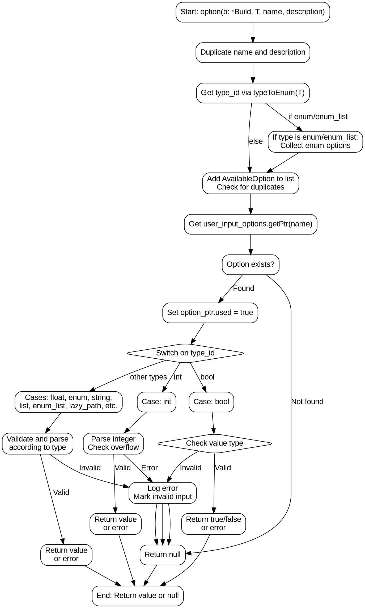

嗯，我需要为这个用Zig编写的函数生成一个流程图。首先，我需要理解这个函数的结构和逻辑。函数名为`option`，参数包括一个`Build`指针、类型`T`、名称和描述。看起来它处理不同的类型选项，比如布尔、整数、枚举等，并进行相应的验证。

首先，函数开始处有一些初始化操作，比如复制名称和描述，获取类型ID。然后根据类型是否为枚举或枚举列表，处理枚举选项。接着将选项添加到可用选项列表中，检查是否重复声明。

然后，函数根据不同的`type_id`进行分支处理，比如处理布尔值、整数、浮点数、枚举、字符串、列表等。每个分支都有不同的验证逻辑，如果不符合预期，会记录错误并标记无效输入。

接下来，我需要将这些逻辑步骤转化为流程图。流程图应该从函数入口开始，依次展示各个步骤，包括条件判断和不同的处理分支。每个条件判断（如`type_id`的不同情况）会导致不同的处理流程。

需要注意的是，函数中有很多条件分支，尤其是`switch`语句中的不同`type_id`情况。每个情况可能有进一步的嵌套条件，比如处理标量值时的不同情况。这些都需要在流程图中清晰展示。

另外，错误处理也是一个重要部分，每个分支在遇到无效输入时都会记录错误并返回null。这些错误路径也需要在流程图中体现。

可能的结构是：

1. 开始
2. 复制名称和描述
3. 确定类型ID
4. 处理枚举选项（如果是枚举类型）
5. 添加可用选项到列表，检查重复
6. 获取用户输入选项
7. 根据类型ID分支处理：
   a. 布尔
   b. 整数
   c. 浮点数
   d. 枚举
   e. 字符串
   f. 列表
   g. 枚举列表
   h. 延迟路径
   i. 延迟路径列表
8. 每个分支中的具体处理逻辑和错误检查
9. 返回结果或错误

需要确保每个分支都正确连接，并且错误路径统一处理。使用Graphviz的话，可能需要使用不同的节点表示步骤，菱形表示条件判断，箭头表示流程方向。

可能遇到的问题包括如何处理大量的分支情况，保持流程图的可读性。可能需要将主要分支作为主流程，而将子分支作为子图，或者使用折叠的方式简化复杂部分。

另外，需要确认每个`switch`中的情况是否覆盖所有可能的`type_id`值，避免遗漏导致流程不完整。

总结来说，流程图需要从函数入口开始，逐步展示每个处理步骤，包括条件判断和错误处理，确保所有可能的路径都被覆盖，并且结构清晰，易于理解。
================================================

该流程图使用Graphviz绘制，展示了函数的核心逻辑：
1. 初始化参数和类型检查
2. 枚举类型的特殊处理
3. 用户输入选项的获取和标记
4. 根据类型ID进行多路分支
5. 每种类型的详细验证逻辑
6. 统一的错误处理机制
7. 最终返回值或错误状态

复杂类型（如float/enum/list等）的处理被折叠到`other_cases`节点以保持简洁，实际实现中每个类型都有类似的验证-解析-返回模式。错误处理通过集中节点`log_error`和`return_null`统一管理。