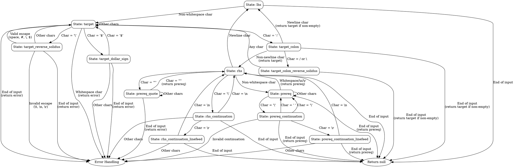

嗯，我需要帮用户用Graphviz画出一个Zig函数的流程图。首先，我得仔细看看这个函数的结构。这个函数是Tokenizer的next方法，看起来是一个状态机，根据不同的状态处理不同的字符，生成Token或者报错。

首先，我需要确定函数中的各个状态和转换条件。函数中的self.state有多个可能的值，比如.lhs、.target、.target_reverse_solidus等等。每个状态下根据不同的字符进行不同的处理，并可能转换到其他状态或者返回Token。

接下来，我应该把这些状态作为流程图中的节点，状态之间的转换条件作为边。每个状态在处理特定字符时会发生什么，比如改变状态、返回Token、或者报错，这些都需要在流程图中体现。

需要注意的是，函数中有循环遍历每个字符，直到处理完所有字符或者遇到结束条件。这可能需要用循环结构来表示，不过Graphviz的流程图更侧重于状态转换，可能不需要详细画出循环结构，而是每个状态的转移。

另外，函数末尾的else块处理的是当self.index超过bytes长度时的情况，即输入结束时的处理。这时候根据当前状态的不同，可能有不同的处理结果，比如返回null、报错，或者完成当前Token的构建。

可能的挑战是处理所有状态转换的条件，确保没有遗漏。同时，如何简洁地表示每个转换的条件（比如字符匹配或输入结束）也需要仔细考虑。

现在，我需要整理所有状态和它们的转换条件：

1. **lhs**：忽略空白字符，遇到非空白则转到target状态。
2. **target**：处理目标字符，遇到$、\、:等特殊字符转到对应状态，否则继续。
3. **target_reverse_solidus**：处理反斜杠后的字符，可能转回target或其他状态。
4. **target_dollar_sign**：需要另一个$，否则报错。
5. **target_colon**：处理冒号后的情况，可能转到target_colon_reverse_solidus或rhs。
6. **target_colon_reverse_solidus**：处理反斜杠后的情况，可能返回target状态。
7. **rhs**：处理右侧的字符，可能进入prereq_quote或prereq状态。
8. **rhs_continuation**和**rhs_continuation_linefeed**：处理续行符。
9. **prereq_quote**：处理引号内的内容，直到遇到结束引号。
10. **prereq**：处理普通的前置条件字符，可能遇到续行符或空格。
11. **prereq_continuation**和**prereq_continuation_linefeed**：处理前置条件的续行情况。

输入结束时（else块），根据当前状态处理未完成的情况，可能返回Token或报错。

接下来，我需要将这些状态和转换用Graphviz的DOT语言表示出来。每个状态是一个节点，边上的标签是转换条件和动作（如返回Token、报错等）。

可能还需要处理一些复杂的分支，比如在同一个状态下根据不同字符转到不同状态。例如，在.target状态下，处理不同的字符会转到不同的子状态，这些需要分别画出。

另外，错误处理的情况（如return errorIllegalChar）也需要作为边，可能连接到终止节点或错误节点。

最后，确保流程图的布局合理，避免交叉过多，可能需要使用子图或者调整节点位置。
================================================

这个流程图使用Graphviz的DOT语言绘制，展示了`next()`函数中各个状态之间的转换逻辑。主要特点包括：

1. 用矩形圆角节点表示12个不同的解析状态
2. 使用椭圆节点表示终止状态（返回null或错误）
3. 箭头上的标签说明转换条件和动作
4. 包含：
   - 正常字符处理流程
   - 特殊字符转义逻辑
   - 续行符处理
   - 引号处理
   - 输入结束时的边界条件处理
   - 错误处理路径

可以通过Graphviz工具（如dot命令）生成PNG/SVG等格式的可视化图表。由于状态较多，建议生成大尺寸图片或使用交互式查看工具浏览。