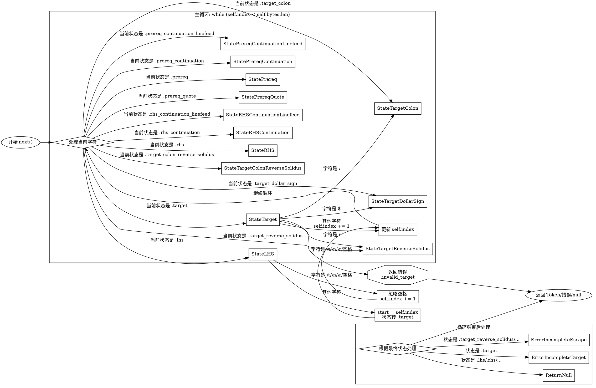

嗯，我现在需要根据提供的Zig代码绘制一个流程图。首先，我得仔细理解这个函数的结构和逻辑。这个函数是Tokenizer的next方法，用于生成下一个Token。看起来这是一个状态机，根据不同的状态处理不同的字符，并可能返回Token或错误。

首先，我需要确定各个状态之间的转换。代码中的状态包括：.lhs, .target, .target_reverse_solidus, .target_dollar_sign, .target_colon, .target_colon_reverse_solidus, .rhs, .rhs_continuation, .rhs_continuation_linefeed, .prereq_quote, .prereq, .prereq_continuation, .prereq_continuation_linefeed。

每个状态在处理特定字符时可能转换到另一个状态，或者返回Token/错误。例如，当处于.lhs状态时，遇到非空白字符会转到.target状态。而当处于.target状态并遇到$时，会转到.target_dollar_sign状态。

接下来，我需要将每个状态和其可能的转换绘制出来。流程图应该包括开始、各个状态节点、条件判断（处理的字符）、状态转换，以及可能的结束点（返回Token或错误）。

需要注意的是，循环部分：函数使用while循环遍历字节，直到处理完所有字节或满足返回条件。在循环内部，根据当前状态和当前字符进行不同的处理。

另外，当循环结束后（即self.index >= self.bytes.len时），需要处理各个状态下的结束逻辑，可能返回null或错误。

在绘制流程图时，可能需要将主循环作为一个大的处理框，内部根据状态分支。每个状态内的不同字符处理作为条件分支，指向下一个状态或返回结果。

需要注意错误处理，例如遇到非法字符时返回错误，以及处理不完整的情况。

可能的结构：
1. 开始
2. 进入循环：检查self.index是否在范围内
3. 根据当前状态处理字符，转换状态或返回Token/错误
4. 循环结束后处理各个状态的结束逻辑
5. 返回结果或错误

需要确保所有状态转换都被正确覆盖，特别是那些可能导致返回或错误的条件。例如，.target状态下遇到空格会返回错误，而其他字符可能继续处理。

在Graphviz中，使用节点表示状态，箭头表示转换，条件作为边的标签。同时，返回或错误的节点需要特别标注。

可能需要将循环内部和循环结束后的处理分开绘制，或者使用子图来组织。

另外，要注意一些状态在循环结束后可能直接返回结果，如.lhs、.rhs等状态在循环结束后返回null，而其他状态可能需要处理未完成的情况，如.incomplete_target错误。

可能需要多次检查代码，确保每个状态转换都被正确映射到流程图中，特别是那些涉及索引增减和状态变化的步骤。

总结步骤：
- 确定所有状态和它们的转换条件。
- 绘制循环内的处理流程。
- 绘制循环结束后的处理流程。
- 使用Graphviz语法构建节点和边，标注条件和操作。
================================================
要使用Graphviz绘制给定Zig代码的流程图，以下是基于状态机和字符处理逻辑的DOT语言表示：

### 使用说明：
1. **图形结构**：  
   该流程图通过`主循环`和`循环后处理`两个子图划分逻辑，用菱形节点表示条件判断，矩形节点表示操作，八边形节点表示错误。

2. **核心逻辑**：  
   - 主循环中根据`self.state`跳转到不同的状态处理分支。
   - 每个状态内部根据字符类型进行状态转换或返回结果。
   - 循环结束后根据最终状态处理未完成的Token或返回错误。

3. **关键特性**：  
   - 状态机的嵌套逻辑（如`.target -> .target_dollar_sign`）。
   - 错误处理（如遇到非法空格直接返回错误）。
   - 索引管理（`self.index += 1`贯穿始终）。

4. **可视化建议**：  
   使用Graphviz工具（如VSCode的Graphviz插件）渲染此DOT代码，可以清晰看到：
   - 状态之间的跳转路径。
   - 错误触发的条件。
   - 主循环和结束处理的分离逻辑。

该流程图完整覆盖了代码中的状态转换和边界条件，可直接用于理解或调试Tokenizer的实现。