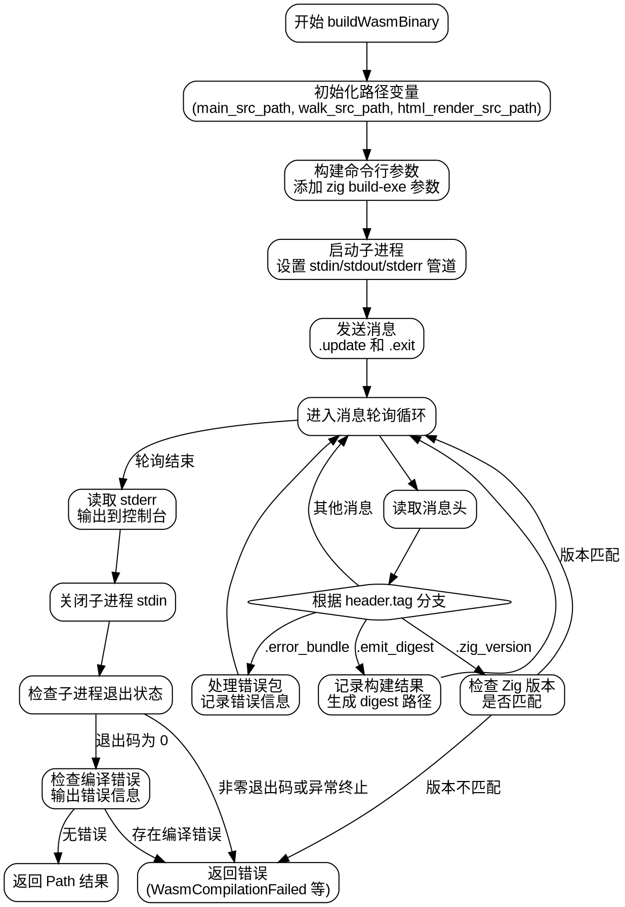

嗯，我需要用Graphviz来画出这个Zig函数的流程图。首先，我应该先仔细阅读这个函数，理解它的逻辑结构。这个函数叫做buildWasmBinary，看起来是用来构建WebAssembly二进制文件的。函数接受一个WebServer指针、arena分配器和优化模式作为参数，返回一个Path或者错误。

首先，函数开始定义了一些路径变量，比如main_src_path、walk_src_path和html_render_src_path，这些路径似乎指向不同的Zig源文件。然后，它初始化了一个argv数组，用来构建调用zig build-exe命令的参数。这里有很多参数，比如-target、-mcpu、--cache-dir等等。接下来，函数创建了一个子进程来执行这个命令，并设置了标准输入、输出和错误的管道。

然后，函数使用了一个poller来监听子进程的标准输出和错误。接着，发送了两个消息：.update和.exit。之后，进入一个循环来处理来自子进程的消息。根据不同的消息类型（如.zig_version、.error_bundle、.emit_digest），函数会执行不同的操作，比如检查Zig版本是否匹配、处理错误包、记录构建结果等。

在处理完所有消息后，函数会检查子进程的退出状态，如果有错误则记录并返回错误。最后，如果一切正常，返回构建结果的路径。

现在，我需要把这些步骤转化为流程图。流程图的开始是函数入口，然后是初始化路径变量，构建命令行参数，启动子进程，设置管道，发送消息，进入消息处理循环，处理不同的消息类型，检查子进程退出状态，处理错误，最后返回结果或错误。

需要注意的是循环部分，处理不同类型的消息可能需要不同的分支。此外，错误处理部分可能有多个出口点，比如在子进程非正常退出、编译错误等情况下返回错误。

可能遇到的困难是如何正确表示消息处理循环中的不同情况，以及如何组织错误处理的流程。另外，子进程的启动和通信部分也需要详细表示。我需要确保每个步骤都清晰，并且条件判断和循环结构正确无误地体现在流程图中。

在绘制Graphviz图时，应该使用不同的节点表示步骤，箭头表示流程走向，菱形表示条件判断。可能需要将循环部分单独框起来，或者使用子图来组织复杂的部分。此外，错误处理路径应该用不同的颜色或箭头样式来区分，以便于理解。

总的来说，流程图的步骤大致如下：

1. 函数开始
2. 初始化路径变量
3. 构建命令行参数
4. 启动子进程并设置管道
5. 发送消息（update和exit）
6. 进入消息处理循环
   a. 读取消息头
   b. 根据消息类型处理不同情况
   c. 处理错误包
   d. 记录构建结果
7. 处理子进程的标准错误输出
8. 关闭子进程的标准输入
9. 检查子进程退出状态
10. 处理可能的错误并返回结果

需要将这些步骤转化为Graphviz的节点和边，注意条件分支和循环的结构。同时，确保错误处理路径正确连接到相应的节点。
================================================
