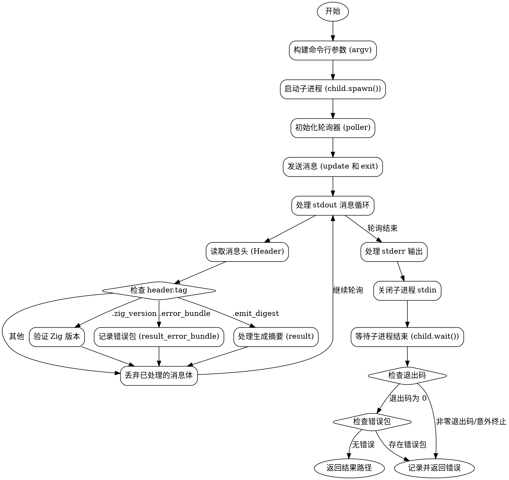

好的，我需要为给定的Zig函数`buildWasmBinary`生成一个Graphviz的流程图。首先，我需要仔细阅读代码，理解其逻辑结构，然后分步骤绘制流程图的各个部分。

首先，函数`buildWasmBinary`的主要步骤包括：

1. **初始化参数**：构建命令行参数，调用Zig编译器构建WASM二进制文件。
2. **启动子进程**：使用这些参数启动一个子进程来执行编译命令。
3. **处理输入输出**：通过管道与子进程的stdin、stdout、stderr进行交互。
4. **轮询和消息处理**：使用轮询机制读取子进程的输出，处理不同的消息类型（如版本检查、错误包、生成摘要等）。
5. **等待子进程结束**：检查子进程的退出状态，处理可能的错误。
6. **处理错误和结果**：根据编译结果返回路径或错误信息。

接下来，需要确定流程图中的各个节点和它们之间的连接。可能的节点包括：

- 开始节点
- 参数构建（argv的组装）
- 启动子进程（child.spawn()）
- 初始化轮询器（poller）
- 发送消息（update和exit）
- 处理stdout的消息循环（读取header和body，根据tag处理不同消息类型）
- 处理stderr的输出
- 关闭stdin，等待子进程结束
- 检查子进程退出状态
- 处理错误包（如果有的话）
- 返回结果或错误

需要注意条件判断和循环结构，例如在处理stdout时的循环读取，以及根据不同的消息类型进行不同的处理。此外，错误处理部分需要多个分支，比如编译错误、进程非正常退出等。

可能遇到的挑战是正确表示消息处理循环中的各种情况，以及确保所有可能的执行路径都被覆盖。需要仔细检查每个条件分支，如`switch (header.tag)`的不同情况，以及错误处理流程。

最后，确保使用Graphviz的正确语法，使用合适的节点形状和箭头连接，使流程图清晰易懂。例如，使用菱形表示条件判断，矩形表示过程步骤，箭头表示流程方向。
================================================
