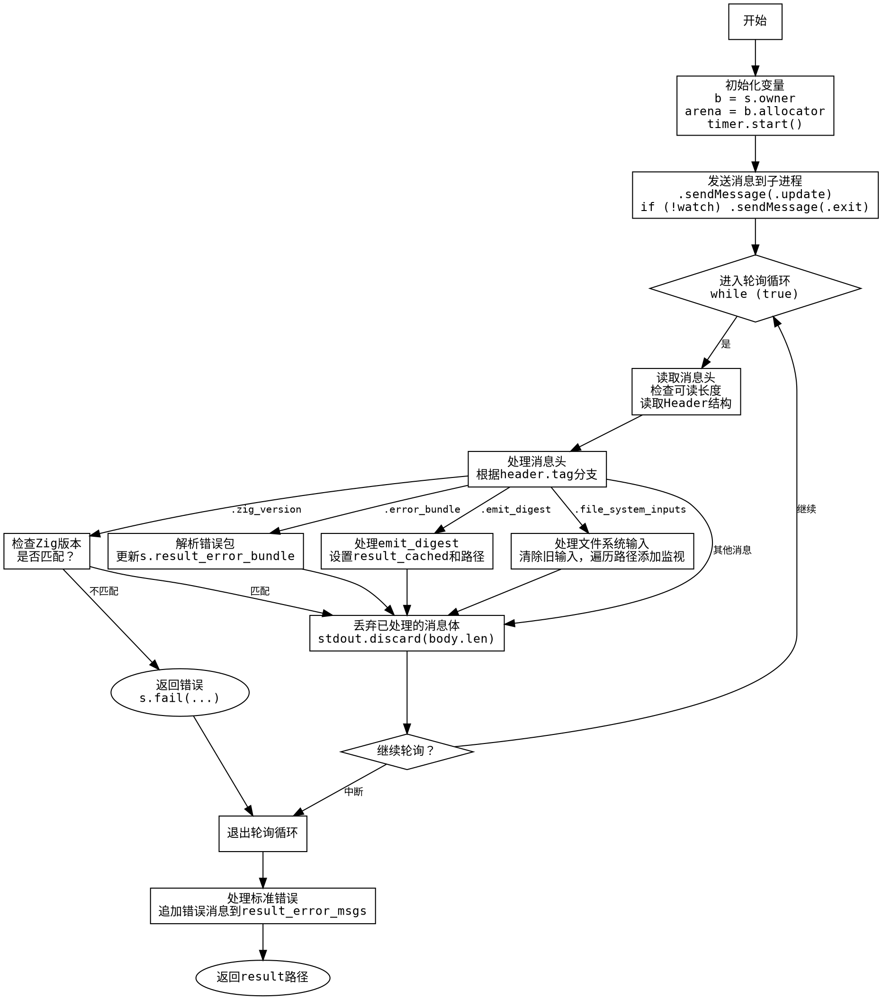

嗯，我需要为这个Zig函数`zigProcessUpdate`绘制一个流程图。首先，我得理解这个函数的结构和逻辑。让我先通读一遍代码，看看它是做什么的。

函数`zigProcessUpdate`接受一个步骤`s`，一个Zig进程`zp`，和一个布尔值`watch`，然后返回一个路径或者错误。看起来它是处理Zig进程的更新，可能和构建过程有关。

首先，函数获取了`s`的拥有者`b`和一个内存分配器`arena`。然后启动了一个计时器`timer`。接下来尝试发送更新和可能的退出消息到子进程的标准输入。之后，处理来自子进程的标准输出消息，根据不同的消息类型执行不同的操作，比如检查Zig版本、处理错误包、处理文件系统输入等。最后处理标准错误，并返回结果路径。

接下来，我需要将这个过程分解成流程图中的各个步骤。流程图通常包括开始、结束、处理步骤、判断节点等。我需要确定每个主要操作和条件分支。

比如，函数开始时启动计时器，发送消息。然后进入一个循环，不断读取标准输出的消息头，根据不同的消息类型进行处理。每个消息类型对应不同的处理逻辑，比如`.zig_version`、`.error_bundle`等。处理完每个消息后，继续循环，直到没有更多数据可读。之后处理标准错误，最后返回结果。

需要注意的是循环部分，这里有一个`poll: while (true)`循环，内部根据可读数据长度来决定是否继续轮询。每个消息类型都有不同的处理分支，比如版本不匹配会返回错误，处理错误包时会更新错误信息，处理文件系统输入时会添加监视路径等。

在绘制流程图时，需要将这些步骤用不同的形状表示：矩形框表示处理步骤，菱形表示判断（如是否watch模式），箭头表示流程走向。可能还需要处理错误路径和循环退出条件。

另外，函数中有多个switch case，每个case对应不同的处理逻辑，这些都需要在流程图中明确表示。例如，当收到`.file_system_inputs`消息时，会清除之前的监视输入，并遍历路径添加新的监视输入，这可能需要一个子流程或循环结构。

最后，处理完所有消息后，记录持续时间，处理标准错误，并返回结果路径。如果有错误消息，则追加到结果错误消息中。

总结一下，流程图的大致结构可能是：

1. 开始
2. 初始化变量（b, arena, timer）
3. 发送消息到子进程
4. 进入轮询循环
   a. 读取消息头
   b. 根据消息类型处理
      i. .zig_version：检查版本
      ii. .error_bundle：处理错误
      iii. .emit_digest：处理缓存
      iv. .file_system_inputs：处理文件系统输入
      v. 其他消息忽略
   c. 丢弃已处理的消息体
5. 退出循环后处理标准错误
6. 返回结果路径或错误

需要确保每个判断和循环都有正确的分支路径，特别是处理不同消息类型时的不同操作。同时，注意错误处理的情况，比如版本不匹配时直接返回错误，而某些情况下可能需要继续处理。

现在，我需要将这些步骤转化为Graphviz的DOT语言，用合适的节点和边来表示流程。可能需要使用子图来组织循环内的处理，或者用多个节点和判断分支来表示不同的消息处理。
================================================

这个流程图的关键节点说明：
1. **消息处理分支**：使用菱形节点表示消息类型的判断，根据不同的header.tag进入不同处理逻辑
2. **轮询循环结构**：使用while循环和检查可读长度的逻辑构成循环主体
3. **错误处理路径**：版本不匹配时直接退出流程
4. **文件系统处理**：包含子路径遍历和多种前缀类型的处理（用注释简化表示）
5. **资源清理**：每个消息体处理完成后都会执行discard操作
6. **最终输出**：处理标准错误后返回最终结果路径

流程图采用自上而下的布局，使用不同形状区分操作步骤（矩形）、判断节点（菱形）和终止节点（椭圆）。边标签使用简明的条件描述，保持流程的可读性。