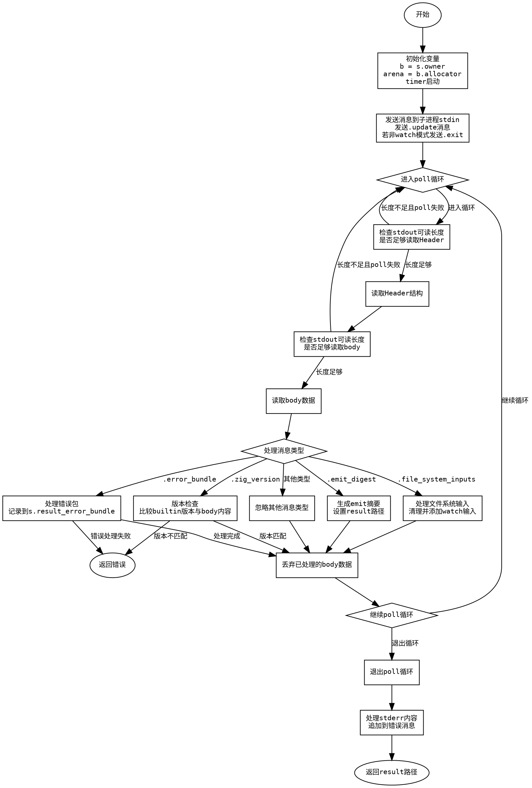

嗯，我需要为给定的Zig函数`zigProcessUpdate`绘制一个流程图。首先，我得仔细理解这个函数的结构和逻辑流程。这个函数似乎处理了与Zig进程的通信，包括发送消息、处理不同的消息类型，并管理错误和结果。

首先，函数开始时初始化了一些变量，比如`b`、`arena`和`timer`。然后尝试发送消息给子进程的stdin，如果是非watch模式，还发送exit消息。接下来进入一个循环，处理来自stdout的不同消息头。

消息处理部分有多个case，比如检查zig版本、处理错误包、生成emit摘要、处理文件系统输入等。每个case都有不同的处理逻辑，比如版本不匹配会返回错误，错误包会记录到s.result_error_bundle，emit摘要会生成路径结果等。

在处理完所有消息后，函数记录执行时间，并处理stderr中的错误信息，最后返回结果路径。

绘制流程图时，需要将每个主要步骤和条件分支表示出来。比如开始节点，初始化变量，发送消息，进入循环，处理不同消息类型，每个消息类型的处理逻辑，可能的错误返回，循环结束后的处理步骤等。

需要注意条件判断，比如`if (!watch)`，循环中的`poll`，以及各个消息类型的switch分支。还要处理可能的错误路径，比如`s.fail`的情况。

流程图的节点应包含操作步骤和判断条件，箭头表示流程方向。使用graphviz的语法，用不同的形状表示开始/结束、操作步骤、条件判断等。

需要确保每个分支都被正确表示，特别是switch中的不同消息类型处理，以及循环中的退出条件。此外，错误处理和资源释放（如discard缓冲区）也需要在流程图中体现。

可能遇到的挑战是如何简洁地表示复杂的switch结构和嵌套循环，同时保持流程图的可读性。可能需要将某些详细步骤合并或分组，避免图形过于复杂。

最后，生成graphviz代码时，要正确使用节点和边的定义，合理布局，确保逻辑清晰。
================================================
