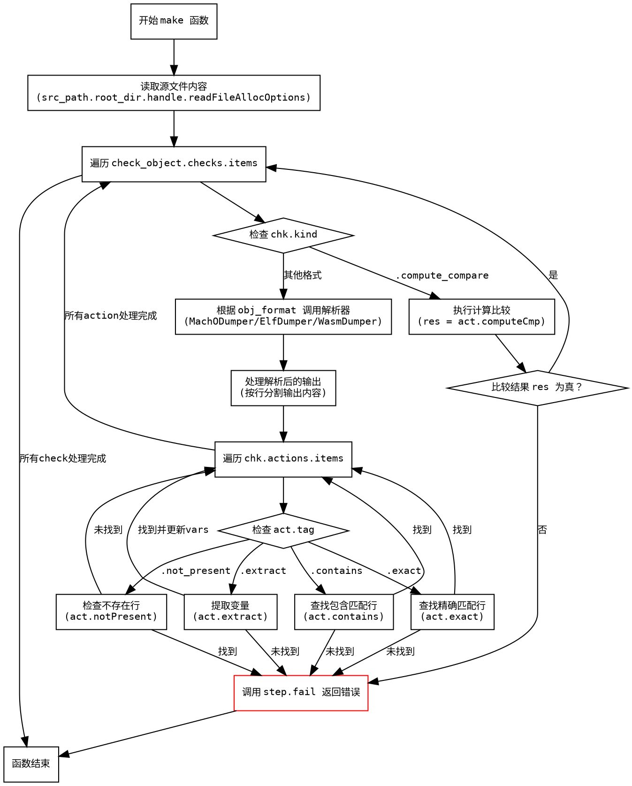

好的，我现在需要为这个用Zig编写的函数生成一个流程图，使用Graphviz。首先，我需要仔细阅读代码，理解它的结构和逻辑流程。这个函数叫做`make`，看起来是处理某种构建步骤中的检查对象。

首先，函数开始部分，获取了一些变量，比如`b`和`gpa`，然后读取了源文件的内容。接下来处理`check_object.checks.items`中的每个检查项。对于每个检查项，根据`chk.kind`的不同，有不同的处理逻辑。比如，当`chk.kind`是`.compute_compare`时，会执行一些计算比较；否则，会根据不同的对象格式（如Mach-O、ELF等）调用对应的解析器。

然后，根据检查项中的动作（actions），比如`.exact`、`.contains`、`.not_present`、`.extract`，进行不同的处理。每个动作都可能触发失败，返回相应的错误信息。

我需要把这些逻辑流程分解成不同的节点和判断分支。例如：

1. 函数入口，初始化变量，读取源文件。
2. 遍历每个检查项（Check）。
3. 对于每个检查项，判断是否是compute_compare类型。
   - 如果是，执行计算比较，检查结果，失败则返回错误。
4. 如果不是，根据对象格式调用对应的解析器，得到输出。
5. 对解析后的输出进行处理，遍历每个动作。
   - 每个动作类型（exact, contains, not_present, extract）有不同的处理逻辑和失败条件。
6. 每个动作处理过程中，如果不符合预期，返回相应的失败信息。

需要注意循环和条件分支的结构，比如`for (check_object.checks.items) |chk|`和内部的`for (chk.actions.items) |act|`循环。此外，错误处理部分也需要体现在流程图中，比如各种`step.fail`的调用。

接下来，将这些步骤转化为Graphviz的节点和边。每个主要步骤作为一个节点，条件判断作为菱形分支节点。循环结构可以用循环的箭头表示，或者通过条件返回继续循环。需要注意的是，Graphviz的流程图通常用矩形表示处理步骤，菱形表示判断，箭头表示流程方向。

可能的结构：

- 开始节点
- 读取文件内容节点
- 遍历Checks循环开始
  - 判断是否是compute_compare
    - 是：执行计算比较，检查结果，失败则返回错误
    - 否：解析对象格式，生成输出
      - 遍历Actions循环
        - 根据动作类型处理，失败则返回错误
- 结束节点

需要确保所有可能的路径都被覆盖，包括错误退出的情况。比如，每次调用`step.fail`都会直接退出函数，流程终止，所以这些应该是终止节点指向结束。

可能还需要处理变量`vars`的更新，特别是在`extract`动作中，但根据代码，这部分可能只在成功时更新，失败时直接退出，所以可能在流程图中不需要特别体现，除非有分支影响。

最后，检查是否有遗漏的条件或循环，确保流程图准确反映代码的逻辑结构。
================================================

这个流程图使用Graphviz语法，展示了：
1. 函数入口的初始化操作
2. 源文件读取过程
3. 遍历检查项的循环结构
4. 针对不同检查类型(.compute_compare和其他格式)的分支
5. 不同对象格式的解析过程
6. 对解析输出的逐行处理
7. 对每个action类型的处理流程
8. 各种失败情况的错误处理路径
9. 使用不同形状表示处理步骤(矩形)和判断分支(菱形)
10. 用红色标注错误退出路径

所有箭头都标有对应的判断条件或操作结果，完整覆盖了代码中的主要逻辑路径。