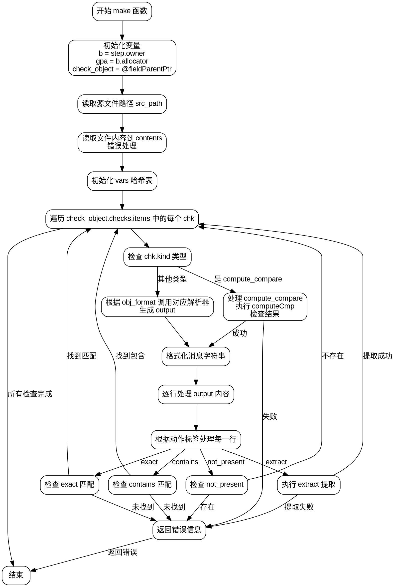

好的，我现在需要为这个Zig函数`make`绘制一个流程图。首先，我需要理解这个函数的结构和逻辑流程。

函数开始于参数`step`和`make_options`，然后忽略`make_options`。接着获取构建器`b`和分配器`gpa`。然后通过`@fieldParentPtr`获取`check_object`，并调用`singleUnchangingWatchInput`方法。接下来读取源文件路径`src_path`，并尝试读取文件内容到`contents`，如果出错则返回错误。

之后，初始化一个字符串到u64的哈希映射`vars`。然后遍历`check_object.checks.items`中的每个检查项`chk`。对于每个检查项，如果是`compute_compare`类型，处理单个动作，执行`computeCmp`，如果失败则返回错误。如果是其他类型（如macho、elf等），根据对象格式调用对应的解析器，生成输出`output`。

然后根据检查类型决定如何格式化消息字符串。接着对输出内容进行逐行处理，根据动作的不同标签（exact、contains、not_present、extract）进行相应的处理，如果不符合预期则返回错误。

现在需要将这些步骤转化为流程图。流程图应包括开始、结束节点，各个处理步骤，条件判断（如检查类型、动作标签），循环（遍历检查项和行），以及错误处理路径。

可能的步骤分解：

1. 函数开始。
2. 初始化变量（b, gpa, check_object）。
3. 读取源文件内容，错误处理。
4. 初始化vars哈希表。
5. 遍历每个检查项chk。
   a. 如果是compute_compare类型：
      i. 处理computeCmp，检查结果，失败则报错。
   b. 否则根据对象格式调用解析器生成output。
6. 格式化消息字符串。
7. 逐行处理output内容。
   a. 根据动作标签处理每一行：
      i. exact：查找匹配行，否则报错。
      ii. contains：查找包含行，否则报错。
      iii. not_present：确保不存在，存在则报错。
      iv. extract：提取变量，否则报错。
8. 所有检查通过后结束。

需要注意循环结构，比如遍历检查项和逐行处理。每个条件分支（如不同的检查类型和动作标签）需要用判断节点表示。错误处理部分需要连接到各个可能出错的地方。

可能遇到的挑战是如何正确表示循环和嵌套条件，特别是当有多个层次的循环（遍历检查项，然后遍历动作项，再逐行处理）。此外，确保所有错误路径都被覆盖，并正确连接到失败节点。

最后，使用Graphviz的语法将这些步骤和逻辑关系用节点和边表示出来，合理使用子图来组织循环和条件分支，保持流程图的可读性。
================================================
