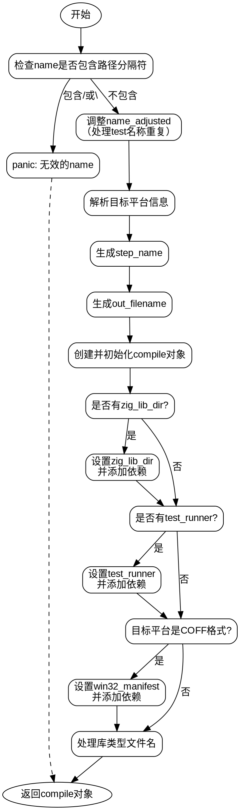

好的，我需要根据用户提供的Zig代码生成一个流程图。首先，我要仔细阅读这段代码，理解它的结构和逻辑流程。代码是Zig语言编写的，函数名为create，属于Build/Step/Compile.zig文件。主要功能似乎是创建一个编译步骤，处理各种编译选项和目标平台相关的配置。

首先，我需要理清函数的执行步骤。函数一开始检查name是否包含路径分隔符，如果有的话会panic。然后根据options.kind调整name_adjusted，避免重复的步骤名称。接着处理目标平台的信息，生成步骤名称step_name。然后生成输出文件名out_filename，并创建compile对象，初始化其各个字段。后续还有条件判断，比如处理zig_lib_dir、test_runner、win32_manifest等，并根据不同的操作系统设置不同的文件名。

接下来，我需要将这些步骤转化为流程图。流程图应该包含开始和结束节点，每个主要的条件判断和操作作为节点，用箭头表示流程的方向。需要注意的是，条件判断会有不同的分支，比如if语句中的true和false分支，或者switch语句的不同情况。

需要注意的几点：
1. 检查name是否包含路径分隔符，如果有则panic。
2. 调整name_adjusted，根据options.kind是否为test且name为"test"。
3. 解析目标平台信息，生成step_name。
4. 生成out_filename。
5. 创建compile对象并初始化。
6. 处理zig_lib_dir和test_runner的条件。
7. 根据目标平台是否为COFF处理win32_manifest。
8. 处理库类型时的不同文件名设置，特别是针对不同操作系统（Darwin、Windows等）。

可能的挑战是如何正确地将所有条件分支和操作步骤组织成清晰的流程图，避免遗漏任何关键步骤。此外，需要确保流程图的逻辑顺序正确，节点之间的连接准确反映代码的执行路径。

现在，我需要将这些步骤转化为Graphviz的DOT语言，确保每个判断和操作都有对应的节点，并用箭头连接起来。同时，要注意处理条件分支的不同情况，例如if-else、switch-case等结构。
================================================

该流程图使用Graphviz的DOT语言绘制，包含以下关键节点：
1. 输入验证：检查name有效性
2. 名称调整：处理test名称的特殊情况
3. 目标平台解析：生成平台相关信息
4. 编译步骤创建：初始化核心数据结构
5. 依赖项处理：处理库目录、测试运行器和Windows清单
6. 输出文件配置：根据平台特性设置不同文件名格式

流程图使用标准形状：
- 椭圆形表示开始/结束节点
- 圆角矩形表示操作步骤
- 条件判断使用标准矩形带分支箭头
- 异常流程用虚线箭头表示